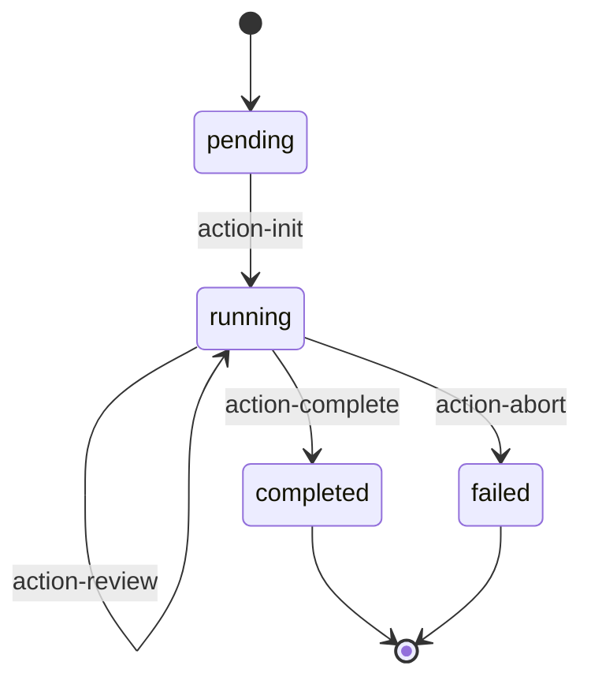

# Autonomous Orchestrator Template

Template for orchestrator file in Autonomous execution mode.

## Purpose

Generate Orchestrator file for Autonomous execution mode, responsible for state-driven action selection and execution loop.

## Usage Context

| Phase | Usage |
|-------|-------|
| Phase 3 (Phase Generation) | Generated when `config.execution_mode === 'autonomous'` |
| Generation Trigger | Create orchestrator logic to manage action selection and state updates |
| Output Location | `.claude/skills/{skill-name}/phases/orchestrator.md` |

---

## Important Notes

> **Phase 0 is mandatory prerequisite**: Before Orchestrator starts execution loop, Phase 0 specification review must be completed first.
>
> When generating Orchestrator, ensure:
> 1. Phase 0 specification review step is included in SKILL.md
> 2. Orchestrator validates specification has been reviewed before starting execution loop
> 3. All Action files reference related specification documents
> 4. Architecture Overview places Phase 0 before Orchestrator

## Template Structure

```markdown
# Orchestrator

## Role

Select and execute next action based on current state.

## State Management

### Read State

\`\`\`javascript
const state = JSON.parse(Read(\`${workDir}/state.json\`));
\`\`\`

### Update State

\`\`\`javascript
function updateState(updates) {
  const state = JSON.parse(Read(\`${workDir}/state.json\`));
  const newState = {
    ...state,
    ...updates,
    updated_at: new Date().toISOString()
  };
  Write(\`${workDir}/state.json\`, JSON.stringify(newState, null, 2));
  return newState;
}
\`\`\`

## Decision Logic

\`\`\`javascript
function selectNextAction(state) {
  // 1. Check termination conditions
  {{termination_checks}}

  // 2. Check error limit
  if (state.error_count >= 3) {
    return 'action-abort';
  }

  // 3. Action selection logic
  {{action_selection_logic}}

  // 4. Default completion
  return 'action-complete';
}
\`\`\`

## Execution Loop

\`\`\`javascript
async function runOrchestrator() {
  console.log('=== Orchestrator Started ===');

  let iteration = 0;
  const MAX_ITERATIONS = 100;

  while (iteration < MAX_ITERATIONS) {
    iteration++;

    // 1. Read current state
    const state = JSON.parse(Read(\`${workDir}/state.json\`));
    console.log(\`[Iteration ${iteration}] Status: ${state.status}\`);

    // 2. Select next action
    const actionId = selectNextAction(state);

    if (!actionId) {
      console.log('No action selected, terminating.');
      break;
    }

    console.log(\`[Iteration ${iteration}] Executing: ${actionId}\`);

    // 3. Update state: current action
    updateState({ current_action: actionId });

    // 4. Execute action
    try {
      const actionPrompt = Read(\`phases/actions/${actionId}.md\`);

      const result = await Task({
        subagent_type: 'universal-executor',
        run_in_background: false,
        prompt: \`
[STATE]
\${JSON.stringify(state, null, 2)}

[ACTION]
\${actionPrompt}

[RETURN]
Return JSON with stateUpdates field.
\`
      });

      const actionResult = JSON.parse(result);

      // 5. Update state: action completed
      updateState({
        current_action: null,
        completed_actions: [...state.completed_actions, actionId],
        ...actionResult.stateUpdates
      });

    } catch (error) {
      // Error handling
      updateState({
        current_action: null,
        errors: [...state.errors, {
          action: actionId,
          message: error.message,
          timestamp: new Date().toISOString()
        }],
        error_count: state.error_count + 1
      });
    }
  }

  console.log('=== Orchestrator Finished ===');
}
\`\`\`

## Action Catalog

| Action | Purpose | Preconditions |
|--------|---------|---------------|
{{action_catalog_table}}

## Termination Conditions

{{termination_conditions_list}}

## Error Recovery

| Error Type | Recovery Strategy |
|------------|-------------------|
| Action execution failed | Retry up to 3 times |
| State inconsistency | Rollback to last stable state |
| User abort | Save current state, allow recovery |
```

## Variable Descriptions

| Variable | Description |
|----------|-------------|
| `{{termination_checks}}` | Termination condition check code |
| `{{action_selection_logic}}` | Action selection logic code |
| `{{action_catalog_table}}` | Action directory table |
| `{{termination_conditions_list}}` | List of termination conditions |

## Generation Function

```javascript
function generateOrchestrator(config) {
  const actions = config.autonomous_config.actions;
  const terminations = config.autonomous_config.termination_conditions || [];

  // Generate termination checks
  const terminationChecks = terminations.map(t => {
    const checks = {
      'user_exit': 'if (state.status === "user_exit") return null;',
      'error_limit': 'if (state.error_count >= 3) return "action-abort";',
      'task_completed': 'if (state.status === "completed") return null;',
      'max_iterations': 'if (state.iteration_count >= 100) return "action-abort";'
    };
    return checks[t] || `if (state.${t}) return null;`;
  }).join('\n  ');

  // Generate action selection logic
  const actionSelectionLogic = actions.map(action => {
    if (!action.preconditions?.length) {
      return `// ${action.name}: No preconditions, add selection logic manually`;
    }
    const conditions = action.preconditions.map(p => `state.${p}`).join(' && ');
    return `if (${conditions}) return '${action.id}';`;
  }).join('\n  ');

  // Generate action catalog table
  const actionCatalogTable = actions.map(a =>
    `| [${a.id}](actions/${a.id}.md) | ${a.description || a.name} | ${a.preconditions?.join(', ') || '-'} |`
  ).join('\n');

  // Generate termination conditions list
  const terminationConditionsList = terminations.map(t => `- ${t}`).join('\n');

  return template
    .replace('{{termination_checks}}', terminationChecks)
    .replace('{{action_selection_logic}}', actionSelectionLogic)
    .replace('{{action_catalog_table}}', actionCatalogTable)
    .replace('{{termination_conditions_list}}', terminationConditionsList);
}
```

## Orchestration Strategies

### 1. Priority Strategy

Select action by predefined priority:

```javascript
const PRIORITY = ['action-init', 'action-process', 'action-review', 'action-complete'];

function selectByPriority(state, availableActions) {
  for (const actionId of PRIORITY) {
    if (availableActions.includes(actionId) && checkPreconditions(actionId, state)) {
      return actionId;
    }
  }
  return null;
}
```

### 2. User-Driven Strategy

Ask user to select next action:

```javascript
async function selectByUser(state, availableActions) {
  const response = await AskUserQuestion({
    questions: [{
      question: "Select next operation:",
      header: "Operations",
      multiSelect: false,
      options: availableActions.map(a => ({
        label: a.name,
        description: a.description
      }))
    }]
  });

  return availableActions.find(a => a.name === response["Operations"])?.id;
}
```

### 3. State-Driven Strategy

Fully automatic decision based on state:

```javascript
function selectByState(state) {
  // Initialization
  if (state.status === 'pending') return 'action-init';

  // Has pending items
  if (state.pending_items?.length > 0) return 'action-process';

  // Needs review
  if (state.needs_review) return 'action-review';

  // Completed
  return 'action-complete';
}
```

## State Machine Example


