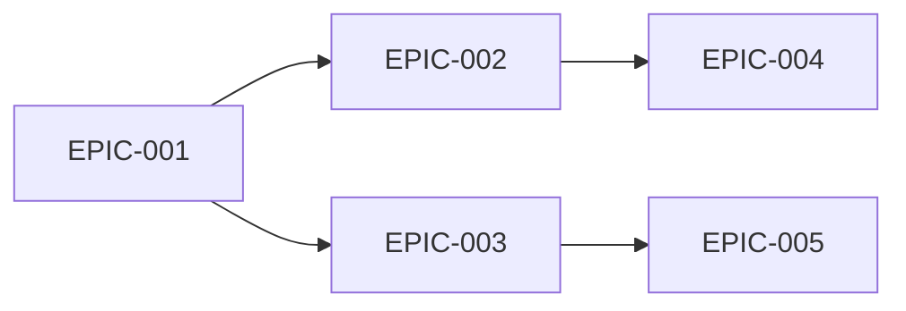

# Epics & Stories Template (Directory Structure)

Template for generating epic/story breakdown as a directory of individual Epic files in Phase 5.

## Usage Context

| Phase | Usage |
|-------|-------|
| Phase 5 (Epics & Stories) | Generate `epics/` directory from requirements decomposition |
| Output Location | `{workDir}/epics/` |

## Output Structure

```
{workDir}/epics/
├── _index.md                      # Overview table + dependency map + MVP scope + execution order
├── EPIC-001-{slug}.md             # Individual Epic with its Stories
├── EPIC-002-{slug}.md
└── ...
```

---

## Template: _index.md

```markdown
---
session_id: {session_id}
phase: 5
document_type: epics-index
status: draft
generated_at: {timestamp}
version: 1
dependencies:
  - ../spec-config.json
  - ../product-brief.md
  - ../requirements/_index.md
  - ../architecture/_index.md
---

# Epics & Stories: {product_name}

{executive_summary - overview of epic structure and MVP scope}

## Epic Overview

| Epic ID | Title | Priority | MVP | Stories | Est. Size |
|---------|-------|----------|-----|---------|-----------|
| [EPIC-001](EPIC-001-{slug}.md) | {title} | Must | Yes | {n} | {S/M/L/XL} |
| [EPIC-002](EPIC-002-{slug}.md) | {title} | Must | Yes | {n} | {S/M/L/XL} |
| [EPIC-003](EPIC-003-{slug}.md) | {title} | Should | No | {n} | {S/M/L/XL} |

## Dependency Map



### Dependency Notes
{explanation of why these dependencies exist and suggested execution order}

### Recommended Execution Order
1. [EPIC-{NNN}](EPIC-{NNN}-{slug}.md): {reason - foundational}
2. [EPIC-{NNN}](EPIC-{NNN}-{slug}.md): {reason - depends on #1}
3. ...

## MVP Scope

### MVP Epics
{list of epics included in MVP with justification, linking to each}

### MVP Definition of Done
- [ ] {MVP completion criterion 1}
- [ ] {MVP completion criterion 2}
- [ ] {MVP completion criterion 3}

## Traceability Matrix

| Requirement | Epic | Stories | Architecture |
|-------------|------|---------|--------------|
| [REQ-001](../requirements/REQ-001-{slug}.md) | [EPIC-001](EPIC-001-{slug}.md) | STORY-001-001, STORY-001-002 | [ADR-001](../architecture/ADR-001-{slug}.md) |
| [REQ-002](../requirements/REQ-002-{slug}.md) | [EPIC-001](EPIC-001-{slug}.md) | STORY-001-003 | Component B |
| [REQ-003](../requirements/REQ-003-{slug}.md) | [EPIC-002](EPIC-002-{slug}.md) | STORY-002-001 | [ADR-002](../architecture/ADR-002-{slug}.md) |

## Estimation Summary

| Size | Meaning | Count |
|------|---------|-------|
| S | Small - well-understood, minimal risk | {n} |
| M | Medium - some complexity, moderate risk | {n} |
| L | Large - significant complexity, should consider splitting | {n} |
| XL | Extra Large - high complexity, must split before implementation | {n} |

## Risks & Considerations

| Risk | Affected Epics | Mitigation |
|------|---------------|------------|
| {risk description} | [EPIC-{NNN}](EPIC-{NNN}-{slug}.md) | {mitigation} |

## Open Questions

- [ ] {question about scope or implementation 1}
- [ ] {question about scope or implementation 2}

## References

- Derived from: [Requirements](../requirements/_index.md), [Architecture](../architecture/_index.md)
- Handoff to: execution workflows (lite-plan, plan, req-plan)
```

---

## Template: EPIC-NNN-{slug}.md (Individual Epic)

```markdown
---
id: EPIC-{NNN}
priority: {Must|Should|Could}
mvp: {true|false}
size: {S|M|L|XL}
requirements: [REQ-{NNN}]
architecture: [ADR-{NNN}]
dependencies: [EPIC-{NNN}]
status: draft
---

# EPIC-{NNN}: {epic_title}

**Priority**: {Must|Should|Could}
**MVP**: {Yes|No}
**Estimated Size**: {S|M|L|XL}

## Description

{detailed epic description}

## Requirements

- [REQ-{NNN}](../requirements/REQ-{NNN}-{slug}.md): {title}
- [REQ-{NNN}](../requirements/REQ-{NNN}-{slug}.md): {title}

## Architecture

- [ADR-{NNN}](../architecture/ADR-{NNN}-{slug}.md): {title}
- Component: {component_name}

## Dependencies

- [EPIC-{NNN}](EPIC-{NNN}-{slug}.md) (blocking): {reason}
- [EPIC-{NNN}](EPIC-{NNN}-{slug}.md) (soft): {reason}

## Stories

### STORY-{EPIC}-001: {story_title}

**User Story**: As a {persona}, I want to {action} so that {benefit}.

**Acceptance Criteria**:
- [ ] {criterion 1}
- [ ] {criterion 2}
- [ ] {criterion 3}

**Size**: {S|M|L|XL}
**Traces to**: [REQ-{NNN}](../requirements/REQ-{NNN}-{slug}.md)

---

### STORY-{EPIC}-002: {story_title}

**User Story**: As a {persona}, I want to {action} so that {benefit}.

**Acceptance Criteria**:
- [ ] {criterion 1}
- [ ] {criterion 2}

**Size**: {S|M|L|XL}
**Traces to**: [REQ-{NNN}](../requirements/REQ-{NNN}-{slug}.md)
```

---

## Variable Descriptions

| Variable | Source | Description |
|----------|--------|-------------|
| `{session_id}` | spec-config.json | Session identifier |
| `{timestamp}` | Runtime | ISO8601 generation timestamp |
| `{product_name}` | product-brief.md | Product/feature name |
| `{EPIC}` | Auto-increment | Epic number (3 digits) |
| `{NNN}` | Auto-increment | Story/requirement number |
| `{slug}` | Auto-generated | Kebab-case from epic/story title |
| `{S\|M\|L\|XL}` | CLI analysis | Relative size estimate |
