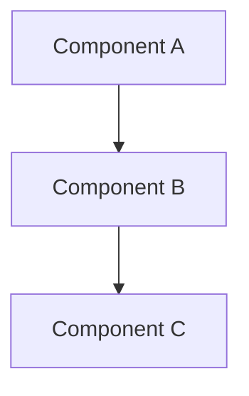
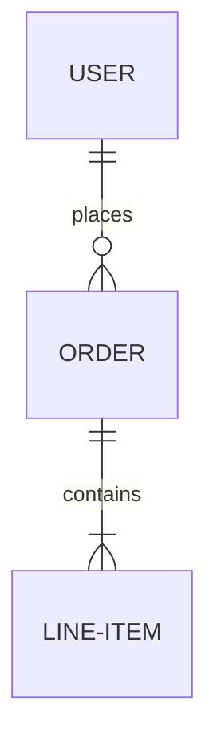

# ⚠️ DEPRECATED: Synthesis Role Template

## DEPRECATION NOTICE

**This template is DEPRECATED and no longer used.**

### Why Deprecated
The `/workflow:brainstorm:synthesis` command has been redesigned:
- **Old behavior**: Generated synthesis-specification.md consolidating all role analyses
- **New behavior**: Performs cross-role analysis, identifies ambiguities, interacts with user for clarification, and updates role analysis.md files directly

### Migration
- **Role analyses are the source of truth**: Each role's analysis.md file is updated directly
- **Planning reads role documents**: The planning phase dynamically reads all role analysis.md files
- **No template needed**: The clarification workflow doesn't require a document template

### Historical Context
This template was used to guide the generation of synthesis-specification.md from multiple role perspectives. It is preserved for historical reference but should not be used in the new architecture.

---

# Original Template (Historical Reference)

## Purpose
Generate comprehensive synthesis-specification.md that consolidates all role perspectives from brainstorming into actionable implementation specification.

## Role Focus
- **Cross-Role Integration**: Synthesize insights from all participating roles
- **Decision Transparency**: Document both adopted and rejected alternatives
- **Process Integration**: Include team capabilities, risks, and collaboration patterns
- **Visual Documentation**: Key diagrams via Mermaid (architecture, data model, user journey)
- **Priority Matrix**: Quantified recommendations with multi-dimensional evaluation
- **Actionable Planning**: Phased implementation roadmap with clear next steps

## Document Structure Template

### synthesis-specification.md

```markdown
# [Topic] - Integrated Implementation Specification

**Framework Reference**: @guidance-specification.md | **Generated**: [timestamp] | **Session**: WFS-[topic-slug]
**Source Integration**: All brainstorming role perspectives consolidated
**Document Type**: Requirements & Design Specification (WHAT to build)

---

## Executive Summary

Provide strategic overview covering:
- **Key Insights**: Major findings from cross-role analysis
- **Breakthrough Opportunities**: Innovation opportunities identified
- **Implementation Priorities**: High-level prioritization with rationale
- **Strategic Direction**: Recommended approach and vision

Include metrics from role synthesis:
- Roles synthesized: [count]
- Requirements captured: [FR/NFR/BR counts]
- Controversial decisions: [count]
- Risk factors identified: [count]

---

## Key Designs & Decisions

### Core Architecture Diagram

*Reference: @system-architect/analysis.md#architecture-diagram*

### User Journey Map

*Reference: @ux-expert/analysis.md#user-journey*

### Data Model Overview

*Reference: @data-architect/analysis.md#data-model*

### Architecture Decision Records (ADRs)

**ADR-01: [Decision Title]**
- **Context**: Background and problem statement
- **Decision**: Chosen approach
- **Rationale**: Why this approach was selected
- **Consequences**: Expected impacts and tradeoffs
- **Reference**: @[role]/analysis.md#adr-01

[Repeat for each major architectural decision]

---

## Controversial Points & Alternatives

Document disagreements and alternative approaches considered:

| Point | Adopted Solution | Alternative Solution(s) | Decision Rationale | Dissenting Roles |
|-------|------------------|-------------------------|--------------------| -----------------|
| Authentication | JWT Token (@security-expert) | Session-Cookie (@system-architect) | Stateless API support for multi-platform | System Architect noted session performance benefits |
| UI Framework | React (@ui-designer) | Vue.js (@subject-matter-expert) | Team expertise and ecosystem maturity | Subject Matter Expert preferred Vue for learning curve |

*This section preserves decision context and rejected alternatives for future reference.*

**Analysis Guidelines**:
- Identify where roles disagreed on approach
- Document both solutions with equal respect
- Explain why one was chosen over the other
- Preserve dissenting perspectives for future consideration

---

## Requirements & Acceptance Criteria

### Functional Requirements

| ID | Description | Rationale Summary | Source | Priority | Acceptance Criteria | Dependencies |
|----|-------------|-------------------|--------|----------|---------------------|--------------|
| FR-01 | User authentication | Enable secure multi-platform access | @product-manager/analysis.md | High | User can login via email/password with MFA | None |
| FR-02 | Data export | User-requested analytics feature | @product-owner/analysis.md | Medium | Export to CSV/JSON formats | FR-01 |

**Guidelines**:
- Extract from product-manager, product-owner, and other role analyses
- Include rationale summary for immediate understanding
- Specify clear, testable acceptance criteria
- Map dependencies between requirements

### Non-Functional Requirements

| ID | Description | Rationale Summary | Target | Validation Method | Source |
|----|-------------|-------------------|--------|-------------------|--------|
| NFR-01 | Response time | UX research shows <200ms critical for engagement | <200ms | Load testing | @ux-expert/analysis.md |
| NFR-02 | Data encryption | Compliance requirement (GDPR, HIPAA) | AES-256 | Security audit | @security-expert/analysis.md |

**Guidelines**:
- Extract performance, security, scalability requirements
- Include specific, measurable targets
- Reference source role for traceability

### Business Requirements

| ID | Description | Rationale Summary | Value | Success Metric | Source |
|----|-------------|-------------------|-------|----------------|--------|
| BR-01 | User retention | Market analysis shows engagement gap | High | 80% 30-day retention | @product-manager/analysis.md |
| BR-02 | Revenue growth | Business case justification for investment | High | 25% MRR increase | @product-owner/analysis.md |

**Guidelines**:
- Capture business value and success metrics
- Link to product-manager and product-owner analyses

---

## Design Specifications

### UI/UX Guidelines
**Consolidated from**: @ui-designer/analysis.md, @ux-expert/analysis.md

- **Component Specifications**: Reusable UI components and patterns
- **Interaction Patterns**: User interaction flows and behaviors
- **Visual Design System**: Colors, typography, spacing guidelines
- **Accessibility Requirements**: WCAG compliance, screen reader support
- **User Flow Specifications**: Step-by-step user journeys
- **Responsive Design**: Mobile, tablet, desktop breakpoints

### Architecture Design
**Consolidated from**: @system-architect/analysis.md, @data-architect/analysis.md

- **System Architecture**: High-level component architecture and interactions
- **Data Flow**: Data processing pipelines and transformations
- **Storage Strategy**: Database selection, schema design, caching
- **Technology Stack**: Languages, frameworks, infrastructure decisions
- **Integration Patterns**: Service communication, API design
- **Scalability Approach**: Horizontal/vertical scaling strategies

### Domain Expertise & Standards
**Consolidated from**: @subject-matter-expert/analysis.md

- **Industry Standards**: Compliance requirements (HIPAA, GDPR, etc.)
- **Best Practices**: Domain-specific proven patterns
- **Regulatory Requirements**: Legal and compliance constraints
- **Technical Quality**: Code quality, testing, documentation standards
- **Domain-Specific Patterns**: Industry-proven architectural patterns

---

## Process & Collaboration Concerns
**Consolidated from**: @scrum-master/analysis.md, @product-owner/analysis.md

### Team Capability Assessment

| Required Skill | Current Level | Gap Analysis | Mitigation Strategy | Reference |
|----------------|---------------|--------------|---------------------|-----------|
| Kubernetes | Intermediate | Need advanced knowledge for scaling | Training + external consultant | @scrum-master/analysis.md |
| React Hooks | Advanced | Team ready | None | @scrum-master/analysis.md |
| GraphQL | Beginner | Significant gap for API layer | 2-week training + mentor pairing | @scrum-master/analysis.md |

**Guidelines**:
- Identify all required technical skills
- Assess team's current capability level
- Document gap and mitigation plan
- Estimate timeline impact of skill gaps

### Process Risks

| Risk | Impact | Probability | Mitigation | Owner | Reference |
|------|--------|-------------|------------|-------|-----------|
| Cross-team API dependency | High | Medium | Early API contract definition | Tech Lead | @scrum-master/analysis.md |
| UX-Dev alignment gap | Medium | High | Weekly design sync meetings | Product Manager | @ux-expert/analysis.md |

**Guidelines**:
- Capture both technical and process risks
- Include probability and impact assessment
- Specify concrete mitigation strategies
- Assign ownership for risk management

### Collaboration Patterns

Document recommended collaboration workflows:

- **Design-Dev Pairing**: UI Designer and Frontend Dev pair programming for complex interactions
- **Architecture Reviews**: Weekly arch review for system-level decisions
- **User Testing Cadence**: Bi-weekly UX testing sessions with real users
- **Code Review Process**: PR review within 24 hours, 2 approvals required
- **Daily Standups**: 15-minute sync across all roles

*Reference: @scrum-master/analysis.md#collaboration*

### Timeline Constraints

Document known constraints that affect planning:

- **Blocking Dependencies**: Project-X API must complete before Phase 2
- **Resource Constraints**: Only 2 backend developers available in Q1
- **External Dependencies**: Third-party OAuth provider integration timeline (6 weeks)
- **Hard Deadlines**: MVP launch date for investor demo (Q2 end)

*Reference: @scrum-master/analysis.md#constraints*

---

## Implementation Roadmap (High-Level)

### Development Phases

**Phase 1** (0-3 months): Foundation and Core Features
- Infrastructure setup and basic architecture
- Core authentication and user management
- Essential functional requirements (FR-01, FR-02, FR-03)
- Foundational UI components

**Phase 2** (3-6 months): Advanced Features and Integrations
- Advanced functional requirements
- Third-party integrations
- Analytics and reporting
- Advanced UI/UX enhancements

**Phase 3** (6+ months): Optimization and Innovation
- Performance optimization
- Advanced analytics and ML features
- Innovation opportunities from brainstorming
- Technical debt reduction

### Technical Guidelines

**Development Standards**:
- Code organization and project structure
- Naming conventions and style guides
- Version control and branching strategy
- Development environment setup

**Testing Strategy**:
- Unit testing (80% coverage minimum)
- Integration testing approach
- E2E testing for critical paths
- Performance testing benchmarks

**Deployment Approach**:
- CI/CD pipeline configuration
- Staging and production environments
- Monitoring and alerting setup
- Rollback procedures

### Feature Grouping (Epic-Level)

**Epic 1: User Authentication & Authorization**
- Requirements: FR-01, FR-03, NFR-02
- Priority: High
- Dependencies: None
- Estimated Timeline: 4 weeks

**Epic 2: Data Management & Export**
- Requirements: FR-02, FR-05, NFR-01
- Priority: Medium
- Dependencies: Epic 1
- Estimated Timeline: 6 weeks

[Continue for all major feature groups]

**Note**: Detailed task breakdown into executable work items is handled by `/workflow:plan` → `IMPL_PLAN.md`

---

## Risk Assessment & Mitigation

### Critical Risks Identified

**Technical Risks**:
1. **Risk**: Database scalability under projected load
   - **Impact**: High (system downtime, user dissatisfaction)
   - **Probability**: Medium
   - **Mitigation**: Early load testing, database sharding plan, caching strategy
   - **Owner**: System Architect

2. **Risk**: Third-party API reliability and rate limits
   - **Impact**: Medium (feature degradation)
   - **Probability**: High
   - **Mitigation**: Implement circuit breakers, fallback mechanisms, local caching
   - **Owner**: Backend Lead

**Process Risks**:
3. **Risk**: Cross-team coordination delays
   - **Impact**: High (timeline slippage)
   - **Probability**: Medium
   - **Mitigation**: Weekly sync meetings, clear API contracts, buffer time in estimates
   - **Owner**: Scrum Master

4. **Risk**: Skill gap in new technologies
   - **Impact**: Medium (quality issues, slower delivery)
   - **Probability**: High
   - **Mitigation**: Training program, pair programming, external consultant support
   - **Owner**: Engineering Manager

### Success Factors

**Key factors for implementation success**:
- Strong product-engineering collaboration with weekly syncs
- Clear acceptance criteria and definition of done
- Regular user testing and feedback integration
- Proactive risk monitoring and mitigation

**Continuous Monitoring Requirements**:
- Sprint velocity and burndown tracking
- Code quality metrics (coverage, complexity, tech debt)
- Performance metrics (response time, error rate, uptime)
- User satisfaction metrics (NPS, usage analytics)

**Quality Gates and Validation Checkpoints**:
- Code review approval before merge
- Automated test suite passing (unit, integration, E2E)
- Security scan and vulnerability assessment
- Performance benchmark validation
- Stakeholder demo and approval before production

---

*Complete implementation specification consolidating all role perspectives into actionable guidance*
```

## Analysis Guidelines for Agent

### Cross-Role Synthesis Process

1. **Load All Role Analyses**: Read guidance-specification.md and all discovered */analysis.md files
2. **Extract Key Insights**: Identify main recommendations, concerns, and innovations from each role
3. **Identify Consensus Areas**: Find common themes across multiple roles
4. **Document Disagreements**: Capture controversial points where roles differ
5. **Prioritize Recommendations**: Use multi-dimensional scoring:
   - Business impact (product-manager, product-owner)
   - Technical feasibility (system-architect, data-architect)
   - Implementation effort (scrum-master, developers)
   - Risk assessment (security-expert, subject-matter-expert)
6. **Create Comprehensive Roadmap**: Synthesize into phased implementation plan

### Quality Standards

- **Completeness**: Integrate ALL discovered role analyses without gaps
- **Visual Clarity**: Include key diagrams (architecture, data model, user journey) via Mermaid or images
- **Decision Transparency**: Document not just decisions, but alternatives and why they were rejected
- **Insight Generation**: Identify cross-role patterns and deep insights beyond individual analyses
- **Actionability**: Provide specific, executable recommendations with clear rationale
- **Balance**: Give equal weight to all role perspectives (process, UX, compliance, functional)
- **Forward-Looking**: Include long-term strategic and innovation considerations
- **Traceability**: Every major decision links to source role analysis via @ references

### @ Reference System

Use @ references to link back to source role analyses:
- `@role/analysis.md` - Reference entire role analysis
- `@role/analysis.md#section` - Reference specific section
- `@guidance-specification.md#point-3` - Reference framework discussion point

### Dynamic Role Handling

- Not all roles participate in every brainstorming session
- Synthesize only roles that produced analysis.md files
- Adapt structure based on available role perspectives
- If role missing, acknowledge gap if relevant to topic

### Output Validation

Before completing, verify:
- [ ] All discovered role analyses integrated
- [ ] Framework discussion points addressed across roles
- [ ] Controversial points documented with dissenting roles identified
- [ ] Process concerns (team skills, risks, collaboration) captured
- [ ] Quantified priority recommendations with evaluation criteria
- [ ] Actionable implementation plan with phased approach
- [ ] Comprehensive risk assessment with mitigation strategies
- [ ] @ references to source analyses throughout document
