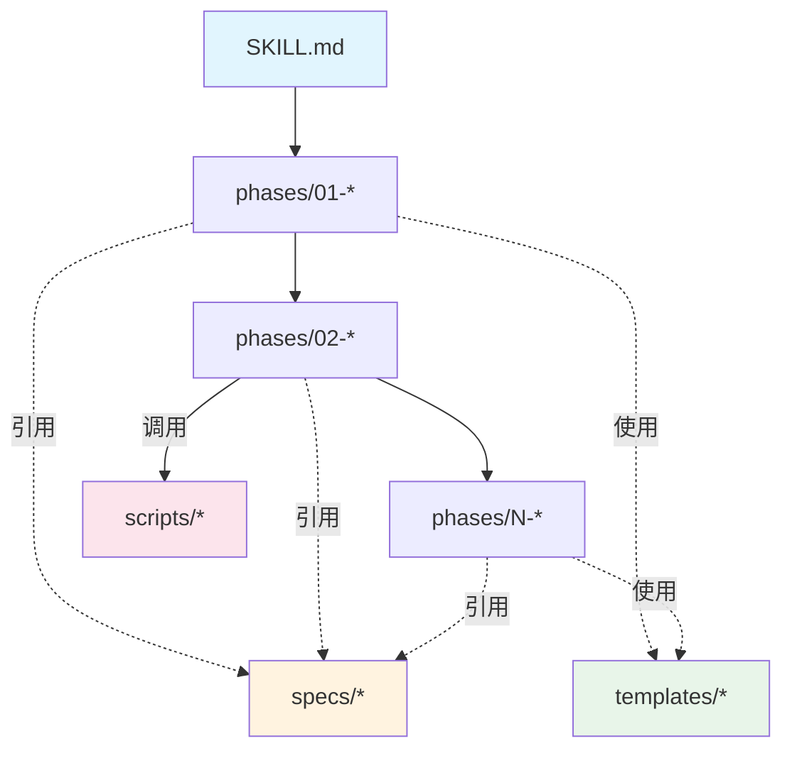

# Skill 设计规范 v1.0

> 基于 `software-manual` 和 `copyright-docs` 两个成熟 Skill 的设计模式提炼

---

## 目录

1. [设计理念](#1-设计理念)
2. [目录结构规范](#2-目录结构规范)
3. [核心组件定义](#3-核心组件定义)
4. [SKILL.md 入口规范](#4-skillmd-入口规范)
5. [Phase 阶段设计规范](#5-phase-阶段设计规范)
6. [Specs 规范文件设计](#6-specs-规范文件设计)
7. [Templates 模板设计](#7-templates-模板设计)
8. [Scripts 脚本规范](#8-scripts-脚本规范)
9. [Prompt 工程规范](#9-prompt-工程规范)
10. [质量控制规范](#10-质量控制规范)
11. [最佳实践清单](#11-最佳实践清单)
12. [示例模板](#12-示例模板)

---

## 1. 设计理念

### 1.1 核心原则

| 原则 | 说明 | 实践 |
|------|------|------|
| **阶段化执行** | 复杂任务分解为有序阶段 | 使用 `phases/` 目录，数字前缀控制顺序 |
| **关注点分离** | 逻辑、配置、视图分离 | `phases/`(逻辑) + `specs/`(配置) + `templates/`(视图) |
| **简要返回** | Agent 返回路径+摘要，避免上下文溢出 | 返回 JSON 简要信息，文件存储完整内容 |
| **配置驱动** | 规范作为"配置文件"，易于调整行为 | 修改 `specs/` 无需触及 `phases/` |
| **模板复用** | 提取通用片段，确保一致性 | `templates/` 存放可复用内容 |

### 1.2 架构模式

```
┌─────────────────────────────────────────────────────────────────┐
│  Context-Optimized Architecture                                  │
├─────────────────────────────────────────────────────────────────┤
│                                                                  │
│  SKILL.md (入口)  →  描述目标、定义阶段、链接资源                 │
│       ↓                                                          │
│  Phase 1: 收集    →  用户输入 + 自动检测 → config.json            │
│       ↓                                                          │
│  Phase 2: 分析    →  并行 Agent → sections/*.md                  │
│       ↓                                                          │
│  Phase N: 汇总    →  交叉检查 → summary.md                       │
│       ↓                                                          │
│  Phase N+1: 组装  →  合并文件 → 最终产物                          │
│       ↓                                                          │
│  Phase N+2: 迭代  →  用户反馈 → 优化                              │
│                                                                  │
└─────────────────────────────────────────────────────────────────┘
```

---

## 2. 目录结构规范

### 2.1 标准目录结构

```
[skill-name]/
├── SKILL.md                     # 【必需】技能入口：元数据 + 架构 + 执行流程
├── phases/                      # 【必需】执行阶段 Prompt
│   ├── 01-{first-step}.md       #   数字前缀定义顺序
│   ├── 02-{second-step}.md
│   ├── 02.5-{sub-step}.md       #   小数点用于插入子步骤
│   └── ...
├── specs/                       # 【必需】规范与约束
│   ├── {domain}-requirements.md #   领域特定要求
│   ├── quality-standards.md     #   质量标准
│   └── writing-style.md         #   写作风格（如适用）
├── templates/                   # 【推荐】可复用模板
│   ├── agent-base.md            #   Agent 基础 Prompt 模板
│   ├── output-shell.{ext}       #   输出外壳模板（html/md）
│   └── css/                     #   样式文件（如适用）
├── scripts/                     # 【可选】辅助脚本
│   ├── {tool}.py                #   Python 脚本
│   └── {tool}-runner.md         #   脚本使用说明
└── outputs/                     # 【运行时】执行产物（不纳入版本控制）
```

### 2.2 命名约定

| 类型 | 规则 | 示例 |
|------|------|------|
| Skill 目录 | 小写-连字符 | `software-manual`, `copyright-docs` |
| Phase 文件 | `NN-{动作}.md` | `01-metadata-collection.md` |
| Spec 文件 | `{领域}-{类型}.md` | `cpcc-requirements.md` |
| Template 文件 | `{用途}-{类型}.{ext}` | `agent-base.md`, `tiddlywiki-shell.html` |
| 输出文件 | `section-{N}-{名称}.md` | `section-2-architecture.md` |

---

## 3. 核心组件定义

### 3.1 组件职责矩阵

| 组件 | 职责 | 内容类型 | 修改频率 |
|------|------|----------|----------|
| `SKILL.md` | 入口 + 编排 | 元数据、架构图、执行流程 | 低（结构稳定） |
| `phases/*.md` | 执行逻辑 | 步骤说明、Prompt、代码示例 | 中（优化迭代） |
| `specs/*.md` | 约束配置 | 规则、标准、检查清单 | 中（需求变更） |
| `templates/*` | 可复用片段 | Prompt 模板、输出格式 | 低（通用稳定） |
| `scripts/*` | 自动化 | Python/JS 脚本 | 高（功能增强） |

### 3.2 组件依赖关系



---

## 4. SKILL.md 入口规范

### 4.1 必需结构

```markdown
---
name: {skill-name}
description: {一句话描述}. {触发关键词}. Triggers on "{关键词1}", "{关键词2}".
allowed-tools: Task, AskUserQuestion, Read, Bash, Glob, Grep, Write, {其他MCP工具}
---

# {Skill 标题}

{一段话描述 Skill 的用途和产出}

## Architecture Overview

{ASCII 或 Mermaid 架构图}

## Key Design Principles

1. **原则1**: 说明
2. **原则2**: 说明
...

## Execution Flow

{阶段执行流程图}

## Agent Configuration (如适用)

| Agent | Role | Output File | Focus Areas |
|-------|------|-------------|-------------|
| ... | ... | ... | ... |

## Directory Setup

{工作目录创建代码}

## Output Structure

{输出目录结构}

## Reference Documents

| Document | Purpose |
|----------|---------|
| [phases/01-xxx.md](phases/01-xxx.md) | ... |
| ... | ... |
```

### 4.2 Front Matter 规范

```yaml
---
name: skill-name              # 必需：Skill 唯一标识
description: |                # 必需：描述 + 触发词
  Generate XXX documents. 
  Triggers on "keyword1", "keyword2".
allowed-tools: |              # 必需：允许使用的工具
  Task, AskUserQuestion, Read, Bash, 
  Glob, Grep, Write, mcp__chrome__*
---
```

---

## 5. Phase 阶段设计规范

### 5.1 Phase 文件结构

```markdown
# Phase N: {阶段名称}

{一句话描述此阶段目标}

## Objective

{详细目标说明}
- 目标1
- 目标2

## Execution Steps

### Step 1: {步骤名称}

{代码或说明}

### Step 2: {步骤名称}

{代码或说明}

## Output

- **File**: `{输出文件名}`
- **Location**: `{输出路径}`
- **Format**: {JSON/Markdown/HTML}

## Next Phase

Proceed to [Phase N+1: xxx](0N+1-xxx.md) with the generated {产出}.
```

### 5.2 Phase 类型

| 类型 | 特点 | 示例 |
|------|------|------|
| **收集型** | 用户交互 + 自动检测 | `01-requirements-discovery.md` |
| **探索型** | 代码分析 + 结构识别 | `02-project-exploration.md` |
| **并行型** | 多 Agent 并行执行 | `03-parallel-analysis.md` |
| **汇总型** | 交叉检查 + 质量验证 | `03.5-consolidation.md` |
| **组装型** | 合并产出 + 格式化 | `04-document-assembly.md` |
| **迭代型** | 用户反馈 + 优化 | `05-iterative-refinement.md` |

### 5.3 Phase 编号规则

```
01-xxx.md      # 主阶段
02-xxx.md      # 主阶段
02.5-xxx.md    # 子阶段（插入 02 和 03 之间）
03-xxx.md      # 主阶段
```

---

## 6. Specs 规范文件设计

### 6.1 Specs 类型

| 类型 | 用途 | 示例 |
|------|------|------|
| **领域要求** | 领域特定合规性 | `cpcc-requirements.md` |
| **质量标准** | 输出质量评估 | `quality-standards.md` |
| **写作风格** | 内容风格指南 | `writing-style.md` |
| **模板规范** | 输出格式定义 | `html-template.md` |

### 6.2 Specs 结构模板

```markdown
# {规范名称}

{规范用途说明}

## When to Use

| Phase | Usage | Section |
|-------|-------|---------|
| Phase N | {使用场景} | {引用章节} |
| ... | ... | ... |

---

## Requirements

### Category 1

- [ ] 检查项1
- [ ] 检查项2

### Category 2

| 项目 | 要求 | 检查方式 |
|------|------|----------|
| ... | ... | ... |

## Validation Function

{验证函数代码}

## Error Handling

| Error | Recovery |
|-------|----------|
| ... | ... |
```

### 6.3 质量标准示例结构

```markdown
# Quality Standards

## Quality Dimensions

### 1. Completeness (25%)
{评分标准}

### 2. Consistency (25%)
{评分标准}

### 3. Depth (25%)
{评分标准}

### 4. Readability (25%)
{评分标准}

## Quality Gates

| Gate | Threshold | Action |
|------|-----------|--------|
| Pass | ≥ 80% | 继续执行 |
| Review | 60-79% | 处理警告后继续 |
| Fail | < 60% | 必须修复 |

## Issue Classification

### Errors (Must Fix)
- ...

### Warnings (Should Fix)
- ...

### Info (Nice to Have)
- ...
```

---

## 7. Templates 模板设计

### 7.1 Agent 基础模板

```markdown
# Agent Base Template

## 通用提示词结构

[ROLE] 你是{角色}，专注于{职责}。

[TASK]
{任务描述}
- 输出: {output_path}
- 格式: {format}
- 范围: {scope}

[CONSTRAINTS]
- 约束1
- 约束2

[OUTPUT_FORMAT]
1. 直接写入文件
2. 返回 JSON 简要信息

[QUALITY_CHECKLIST]
- [ ] 检查项1
- [ ] 检查项2

## 变量说明

| 变量 | 来源 | 示例 |
|------|------|------|
| {output_dir} | Phase 1 | .workflow/.scratchpad/xxx |
| ... | ... | ... |

## Agent 配置映射

{AGENT_ROLES, AGENT_SECTIONS, AGENT_FILES, AGENT_FOCUS}
```

### 7.2 输出模板规范

```html
<!-- output-shell.html 示例 -->
<!DOCTYPE html>
<html>
<head>
    <meta charset="UTF-8">
    <title>{{title}}</title>
    <style>
        /* 内嵌 CSS */
        {{styles}}
    </style>
</head>
<body>
    <div id="app">
        {{content}}
    </div>
    <script>
        /* 内嵌 JS */
        {{scripts}}
    </script>
</body>
</html>
```

### 7.3 占位符规范

| 占位符格式 | 用途 | 示例 |
|------------|------|------|
| `{{variable}}` | 简单变量替换 | `{{title}}` |
| `${variable}` | JavaScript 模板字符串 | `${workDir}` |
| `{placeholder}` | Prompt 占位 | `{intro}`, `{diagram}` |

---

## 8. Scripts 脚本规范

### 8.1 脚本类型

| 类型 | 用途 | 命名 |
|------|------|------|
| **提取器** | 从代码提取信息 | `extract_*.py` |
| **组装器** | 合并/转换文件 | `assemble_*.py` |
| **验证器** | 检查合规性 | `validate_*.py` |
| **辅助器** | 工具函数 | `*_helper.py` |

### 8.2 脚本使用说明文件

每个脚本应有对应的 `.md` 说明文件：

```markdown
# {Script Name} Runner

## Purpose

{脚本用途}

## Usage

{命令行使用方式}

## Parameters

| 参数 | 说明 | 默认值 |
|------|------|--------|
| ... | ... | ... |

## Output

{输出说明}

## Example

{使用示例}
```

---

## 9. Prompt 工程规范

### 9.1 Prompt 结构标准

```
[ROLE] {角色定义}

[PROJECT CONTEXT]
项目类型: {type}
语言: {language}
名称: {name}

[TASK]
{任务描述}
输出: {output_path}

[INPUT]
- 配置: {config_path}
- 扫描路径: {scan_paths}

[CONTENT REQUIREMENTS]
- 标题层级: # ## ### (最多3级)
- 代码块: ```language ... ``` (必须标注语言)
- 表格: | col1 | col2 | 格式
- 列表: 有序 1. 2. 3. / 无序 - - -

[FOCUS]
{重点关注项}

[OUTPUT FORMAT]
{输出格式说明}

[RETURN JSON]
{返回结构}
```

### 9.2 效率优化原则

| 原则 | Before (冗余) | After (精简) |
|------|---------------|--------------|
| **角色简化** | "你是一个专业的系统架构师，具有丰富的软件设计经验..." | `[ROLE] 系统架构师，专注于分层设计和模块依赖` |
| **模板驱动** | "请按照以下格式输出: 首先写一个二级标题..." | `[TEMPLATE] ## 2. 标题 {content}` |
| **焦点明确** | "分析项目的各个方面，包括架构、模块、依赖等" | `[FOCUS] 1. 分层 2. 模块 3. 依赖 4. 数据流` |
| **返回简洁** | "请返回详细的分析结果，包括所有发现的问题..." | `[RETURN] {"status":"completed","output_file":"xxx.md","summary":"<50字"}` |

### 9.3 Agent 返回格式标准

```typescript
interface AgentReturn {
  status: "completed" | "partial" | "failed";
  output_file: string;           // 输出文件路径
  summary: string;               // 最多 50 字摘要
  cross_module_notes?: string[]; // 跨模块备注
  stats?: {                      // 统计信息
    diagrams?: number;
    words?: number;
  };
  screenshots_needed?: Array<{   // 截图需求（如适用）
    id: string;
    url: string;
    description: string;
  }>;
}
```

---

## 10. 质量控制规范

### 10.1 质量维度

| 维度 | 权重 | 检查项 |
|------|------|--------|
| **完整性** | 25% | 所有必需章节存在且有实质内容 |
| **一致性** | 25% | 术语、格式、风格统一 |
| **深度** | 25% | 内容详尽、示例充分 |
| **可读性** | 25% | 结构清晰、语言简洁 |

### 10.2 质量门控

```javascript
const QUALITY_GATES = {
  pass: { threshold: 80, action: "继续执行" },
  review: { threshold: 60, action: "处理警告后继续" },
  fail: { threshold: 0, action: "必须修复后重试" }
};
```

### 10.3 问题分类

| 级别 | 前缀 | 含义 | 处理方式 |
|------|------|------|----------|
| **Error** | E | 阻塞性问题 | 必须修复 |
| **Warning** | W | 影响质量 | 建议修复 |
| **Info** | I | 可改进项 | 可选修复 |

### 10.4 自动化检查函数模板

```javascript
function runQualityChecks(workDir) {
  const results = {
    completeness: checkCompleteness(workDir),
    consistency: checkConsistency(workDir),
    depth: checkDepth(workDir),
    readability: checkReadability(workDir)
  };

  results.overall = Object.values(results).reduce((a, b) => a + b) / 4;
  
  return {
    score: results.overall,
    gate: results.overall >= 80 ? 'pass' : 
          results.overall >= 60 ? 'review' : 'fail',
    details: results
  };
}
```

---

## 11. 最佳实践清单

### 11.1 Skill 设计

- [ ] **单一职责**: 每个 Skill 专注一个领域
- [ ] **清晰入口**: SKILL.md 完整描述目标和流程
- [ ] **阶段分解**: 复杂任务拆分为 3-7 个阶段
- [ ] **顺序命名**: 使用数字前缀控制执行顺序

### 11.2 Phase 设计

- [ ] **明确目标**: 每个 Phase 有清晰的输入输出
- [ ] **独立可测**: 每个 Phase 可单独调试
- [ ] **链接下一步**: 明确说明后续阶段

### 11.3 Prompt 设计

- [ ] **角色明确**: 使用 `[ROLE]` 定义 Agent 身份
- [ ] **任务具体**: 使用 `[TASK]` 明确执行目标
- [ ] **约束清晰**: 使用 `[CONSTRAINTS]` 定义边界
- [ ] **返回简洁**: Agent 返回路径+摘要，非完整内容

### 11.4 质量控制

- [ ] **规范驱动**: 使用 `specs/` 定义可验证的标准
- [ ] **汇总检查**: 设置 Consolidation 阶段交叉验证
- [ ] **问题分级**: 区分 Error/Warning/Info
- [ ] **迭代优化**: 支持用户反馈循环

---

## 12. 示例模板

### 12.1 新 Skill 快速启动模板

```bash
# 创建 Skill 目录结构
mkdir -p my-skill/{phases,specs,templates,scripts}

# 创建核心文件
touch my-skill/SKILL.md
touch my-skill/phases/{01-collection,02-analysis,03-assembly}.md
touch my-skill/specs/{requirements,quality-standards}.md
touch my-skill/templates/agent-base.md
```

### 12.2 SKILL.md 最小模板

```markdown
---
name: my-skill
description: Generate XXX. Triggers on "keyword1", "keyword2".
allowed-tools: Task, AskUserQuestion, Read, Bash, Glob, Grep, Write
---

# My Skill

Generate XXX through multi-phase analysis.

## Execution Flow

1. Phase 1: Collection → config.json
2. Phase 2: Analysis → sections/*.md
3. Phase 3: Assembly → output.md

## Reference Documents

| Document | Purpose |
|----------|---------|
| [phases/01-collection.md](phases/01-collection.md) | 信息收集 |
| [phases/02-analysis.md](phases/02-analysis.md) | 代码分析 |
| [phases/03-assembly.md](phases/03-assembly.md) | 文档组装 |
```

---

## 附录 A: 设计对比

| 设计点 | software-manual | copyright-docs |
|--------|-----------------|----------------|
| 阶段数 | 6 | 5 |
| 并行 Agent | 6 | 6 |
| 输出格式 | HTML | Markdown |
| 质量检查 | 4 维度评分 | CPCC 合规检查 |
| 截图支持 | Chrome MCP | 无 |
| 迭代优化 | 用户反馈循环 | 合规验证循环 |

## 附录 B: 工具依赖

| 工具 | 用途 | 适用 Skill |
|------|------|------------|
| `Task` | 启动子 Agent | 所有 |
| `AskUserQuestion` | 用户交互 | 所有 |
| `Read/Write/Glob/Grep` | 文件操作 | 所有 |
| `Bash` | 脚本执行 | 需要自动化 |
| `mcp__chrome__*` | 浏览器截图 | UI 相关 |

---

*规范版本: 1.0*  
*基于: software-manual, copyright-docs*  
*最后更新: 2026-01-03*
