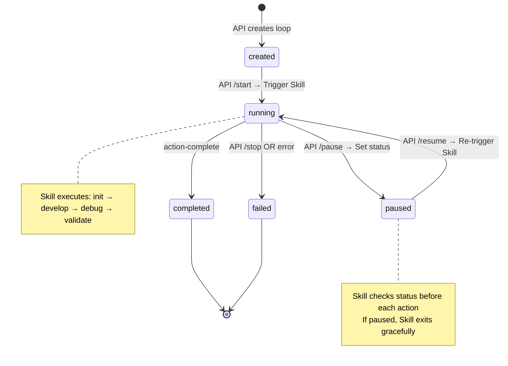

# Orchestrator

根据当前状态选择并执行下一个动作，实现无状态循环工作流。与 API (loop-v2-routes.ts) 协作实现控制平面/执行平面分离。

## Role

检查控制信号 → 读取文件状态 → 选择动作 → 执行 → 更新文件 → 循环，直到完成或被外部暂停/停止。

## State Management (Unified Location)

### 读取状态

```javascript
const getUtc8ISOString = () => new Date(Date.now() + 8 * 60 * 60 * 1000).toISOString()

/**
 * 读取循环状态 (统一位置)
 * @param loopId - Loop ID (e.g., "loop-v2-20260122-abc123")
 */
function readLoopState(loopId) {
  const stateFile = `.loop/${loopId}.json`

  if (!fs.existsSync(stateFile)) {
    return null
  }

  const state = JSON.parse(Read(stateFile))
  return state
}
```

### 更新状态

```javascript
/**
 * 更新循环状态 (只更新 skill_state 部分，不修改 API 字段)
 * @param loopId - Loop ID
 * @param updates - 更新内容 (skill_state 字段)
 */
function updateLoopState(loopId, updates) {
  const stateFile = `.loop/${loopId}.json`
  const currentState = readLoopState(loopId)

  if (!currentState) {
    throw new Error(`Loop state not found: ${loopId}`)
  }

  // 只更新 skill_state 和 updated_at
  const newState = {
    ...currentState,
    updated_at: getUtc8ISOString(),
    skill_state: {
      ...currentState.skill_state,
      ...updates
    }
  }

  Write(stateFile, JSON.stringify(newState, null, 2))
  return newState
}
```

### 创建新循环状态 (直接调用时)

```javascript
/**
 * 创建新的循环状态 (仅在直接调用时使用，API 触发时状态已存在)
 */
function createLoopState(loopId, taskDescription) {
  const stateFile = `.loop/${loopId}.json`
  const now = getUtc8ISOString()

  const state = {
    // API 兼容字段
    loop_id: loopId,
    title: taskDescription.substring(0, 100),
    description: taskDescription,
    max_iterations: 10,
    status: 'running',  // 直接调用时设为 running
    current_iteration: 0,
    created_at: now,
    updated_at: now,

    // Skill 扩展字段
    skill_state: null  // 由 action-init 初始化
  }

  // 确保目录存在
  Bash(`mkdir -p ".loop"`)
  Bash(`mkdir -p ".loop/${loopId}.progress"`)

  Write(stateFile, JSON.stringify(state, null, 2))
  return state
}
```

## Control Signal Checking

```javascript
/**
 * 检查 API 控制信号
 * 必须在每个 Action 开始前调用
 * @returns { continue: boolean, reason: string }
 */
function checkControlSignals(loopId) {
  const state = readLoopState(loopId)

  if (!state) {
    return { continue: false, reason: 'state_not_found' }
  }

  switch (state.status) {
    case 'paused':
      // API 暂停了循环，Skill 应退出等待 resume
      console.log(`⏸️ Loop paused by API. Waiting for resume...`)
      return { continue: false, reason: 'paused' }

    case 'failed':
      // API 停止了循环 (用户手动停止)
      console.log(`⏹️ Loop stopped by API.`)
      return { continue: false, reason: 'stopped' }

    case 'completed':
      // 已完成
      console.log(`✅ Loop already completed.`)
      return { continue: false, reason: 'completed' }

    case 'created':
      // API 创建但未启动 (不应该走到这里)
      console.log(`⚠️ Loop not started by API.`)
      return { continue: false, reason: 'not_started' }

    case 'running':
      // 正常继续
      return { continue: true, reason: 'running' }

    default:
      console.log(`⚠️ Unknown status: ${state.status}`)
      return { continue: false, reason: 'unknown_status' }
  }
}
```

## Decision Logic

```javascript
/**
 * 选择下一个 Action (基于 skill_state)
 */
function selectNextAction(state, mode = 'interactive') {
  const skillState = state.skill_state

  // 1. 终止条件检查 (API status)
  if (state.status === 'completed') return null
  if (state.status === 'failed') return null
  if (state.current_iteration >= state.max_iterations) {
    console.warn(`已达到最大迭代次数 (${state.max_iterations})`)
    return 'action-complete'
  }

  // 2. 初始化检查
  if (!skillState || !skillState.current_action) {
    return 'action-init'
  }

  // 3. 模式判断
  if (mode === 'interactive') {
    return 'action-menu'  // 显示菜单让用户选择
  }

  // 4. 自动模式：基于状态自动选择
  if (mode === 'auto') {
    // 按优先级：develop → debug → validate

    // 如果有待开发任务
    const hasPendingDevelop = skillState.develop?.tasks?.some(t => t.status === 'pending')
    if (hasPendingDevelop) {
      return 'action-develop-with-file'
    }

    // 如果开发完成但未调试
    if (skillState.last_action === 'action-develop-with-file') {
      const needsDebug = skillState.develop?.completed < skillState.develop?.total
      if (needsDebug) {
        return 'action-debug-with-file'
      }
    }

    // 如果调试完成但未验证
    if (skillState.last_action === 'action-debug-with-file' ||
        skillState.debug?.confirmed_hypothesis) {
      return 'action-validate-with-file'
    }

    // 如果验证失败，回到开发
    if (skillState.last_action === 'action-validate-with-file') {
      if (!skillState.validate?.passed) {
        return 'action-develop-with-file'
      }
    }

    // 全部通过，完成
    if (skillState.validate?.passed && !hasPendingDevelop) {
      return 'action-complete'
    }

    // 默认：开发
    return 'action-develop-with-file'
  }

  // 5. 默认完成
  return 'action-complete'
}
```

## Execution Loop

```javascript
/**
 * 运行编排器
 * @param options.loopId - 现有 Loop ID (API 触发时)
 * @param options.task - 任务描述 (直接调用时)
 * @param options.mode - 'interactive' | 'auto'
 */
async function runOrchestrator(options = {}) {
  const { loopId: existingLoopId, task, mode = 'interactive' } = options

  console.log('=== CCW Loop Orchestrator Started ===')

  // 1. 确定 loopId
  let loopId
  let state

  if (existingLoopId) {
    // API 触发：使用现有 loopId
    loopId = existingLoopId
    state = readLoopState(loopId)

    if (!state) {
      console.error(`Loop not found: ${loopId}`)
      return { status: 'error', message: 'Loop not found' }
    }

    console.log(`Resuming loop: ${loopId}`)
    console.log(`Status: ${state.status}`)

  } else if (task) {
    // 直接调用：创建新 loopId
    const timestamp = getUtc8ISOString().replace(/[-:]/g, '').split('.')[0]
    const random = Math.random().toString(36).substring(2, 10)
    loopId = `loop-v2-${timestamp}-${random}`

    console.log(`Creating new loop: ${loopId}`)
    console.log(`Task: ${task}`)

    state = createLoopState(loopId, task)

  } else {
    console.error('Either --loop-id or task description is required')
    return { status: 'error', message: 'Missing loopId or task' }
  }

  const progressDir = `.loop/${loopId}.progress`

  // 2. 主循环
  let iteration = state.current_iteration || 0

  while (iteration < state.max_iterations) {
    iteration++

    // ========================================
    // CRITICAL: Check control signals first
    // ========================================
    const control = checkControlSignals(loopId)
    if (!control.continue) {
      console.log(`\n🛑 Loop terminated: ${control.reason}`)
      break
    }

    // 重新读取状态 (可能被 API 更新)
    state = readLoopState(loopId)

    console.log(`\n[Iteration ${iteration}] Status: ${state.status}`)

    // 选择下一个动作
    const actionId = selectNextAction(state, mode)

    if (!actionId) {
      console.log('No action selected, terminating.')
      break
    }

    console.log(`[Iteration ${iteration}] Executing: ${actionId}`)

    // 更新 current_iteration
    state = {
      ...state,
      current_iteration: iteration,
      updated_at: getUtc8ISOString()
    }
    Write(`.loop/${loopId}.json`, JSON.stringify(state, null, 2))

    // 执行动作
    try {
      const actionPromptFile = `.claude/skills/ccw-loop/phases/actions/${actionId}.md`

      if (!fs.existsSync(actionPromptFile)) {
        console.error(`Action file not found: ${actionPromptFile}`)
        continue
      }

      const actionPrompt = Read(actionPromptFile)

      // 构建 Agent 提示
      const agentPrompt = `
[LOOP CONTEXT]
Loop ID: ${loopId}
State File: .loop/${loopId}.json
Progress Dir: ${progressDir}

[CURRENT STATE]
${JSON.stringify(state, null, 2)}

[ACTION INSTRUCTIONS]
${actionPrompt}

[TASK]
You are executing ${actionId} for loop: ${state.title || state.description}

[CONTROL SIGNALS]
Before executing, check if status is still 'running'.
If status is 'paused' or 'failed', exit gracefully.

[RETURN]
Return JSON with:
- skillStateUpdates: Object with skill_state fields to update
- continue: Boolean indicating if loop should continue
- message: String with user message
`

      const result = await Task({
        subagent_type: 'universal-executor',
        run_in_background: false,
        description: `Execute ${actionId}`,
        prompt: agentPrompt
      })

      // 解析结果
      const actionResult = JSON.parse(result)

      // 更新状态 (只更新 skill_state)
      updateLoopState(loopId, {
        current_action: null,
        last_action: actionId,
        completed_actions: [
          ...(state.skill_state?.completed_actions || []),
          actionId
        ],
        ...actionResult.skillStateUpdates
      })

      // 显示消息
      if (actionResult.message) {
        console.log(`\n${actionResult.message}`)
      }

      // 检查是否继续
      if (actionResult.continue === false) {
        console.log('Action requested termination.')
        break
      }

    } catch (error) {
      console.error(`Error executing ${actionId}: ${error.message}`)

      // 错误处理
      updateLoopState(loopId, {
        current_action: null,
        errors: [
          ...(state.skill_state?.errors || []),
          {
            action: actionId,
            message: error.message,
            timestamp: getUtc8ISOString()
          }
        ]
      })
    }
  }

  if (iteration >= state.max_iterations) {
    console.log(`\n⚠️ Reached maximum iterations (${state.max_iterations})`)
    console.log('Consider breaking down the task or taking a break.')
  }

  console.log('\n=== CCW Loop Orchestrator Finished ===')

  // 返回最终状态
  const finalState = readLoopState(loopId)
  return {
    status: finalState.status,
    loop_id: loopId,
    iterations: iteration,
    final_state: finalState
  }
}
```

## Action Catalog

| Action | Purpose | Preconditions | Effects |
|--------|---------|---------------|---------|
| [action-init](actions/action-init.md) | 初始化会话 | status=pending | initialized=true |
| [action-menu](actions/action-menu.md) | 显示操作菜单 | initialized=true | 用户选择下一动作 |
| [action-develop-with-file](actions/action-develop-with-file.md) | 开发任务 | initialized=true | 更新 progress.md |
| [action-debug-with-file](actions/action-debug-with-file.md) | 假设调试 | initialized=true | 更新 understanding.md |
| [action-validate-with-file](actions/action-validate-with-file.md) | 测试验证 | initialized=true | 更新 validation.md |
| [action-complete](actions/action-complete.md) | 完成循环 | validation_passed=true | status=completed |

## Termination Conditions

1. **API 暂停**: `state.status === 'paused'` (Skill 退出，等待 resume)
2. **API 停止**: `state.status === 'failed'` (Skill 终止)
3. **任务完成**: `state.status === 'completed'`
4. **迭代限制**: `state.current_iteration >= state.max_iterations`
5. **Action 请求终止**: `actionResult.continue === false`

## Error Recovery

| Error Type | Recovery Strategy |
|------------|-------------------|
| 动作执行失败 | 记录错误，增加 error_count，继续下一动作 |
| 状态文件损坏 | 从其他文件重建状态 (progress.md, understanding.md 等) |
| 用户中止 | 保存当前状态，允许 --resume 恢复 |
| CLI 工具失败 | 回退到手动分析模式 |

## Mode Strategies

### Interactive Mode (默认)

每次显示菜单，让用户选择动作：

```
当前状态: 开发中
可用操作:
  1. 继续开发 (develop)
  2. 开始调试 (debug)
  3. 运行验证 (validate)
  4. 查看进度 (status)
  5. 退出 (exit)

请选择:
```

### Auto Mode (自动循环)

按预设流程自动执行：

```
Develop → Debug → Validate →
  ↓ (如验证失败)
Develop (修复) → Debug → Validate → 完成
```

## State Machine (API Status)


