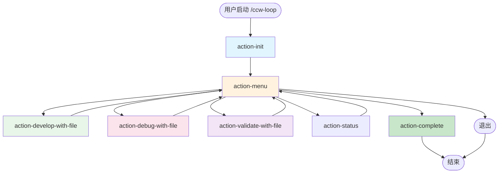

# Action Catalog

CCW Loop 所有可用动作的目录和说明。

## Available Actions

| Action | Purpose | Preconditions | Effects | CLI Integration |
|--------|---------|---------------|---------|-----------------|
| [action-init](../phases/actions/action-init.md) | 初始化会话 | status=pending, initialized=false | status→running, initialized→true, 创建目录和任务列表 | Gemini 任务分解 |
| [action-menu](../phases/actions/action-menu.md) | 显示操作菜单 | initialized=true, status=running | 返回用户选择的动作 | - |
| [action-develop-with-file](../phases/actions/action-develop-with-file.md) | 执行开发任务 | initialized=true, pending tasks > 0 | 更新 progress.md, 完成一个任务 | Gemini 代码实现 |
| [action-debug-with-file](../phases/actions/action-debug-with-file.md) | 假设驱动调试 | initialized=true | 更新 understanding.md, hypotheses.json | Gemini 假设生成和证据分析 |
| [action-validate-with-file](../phases/actions/action-validate-with-file.md) | 运行测试验证 | initialized=true, develop > 0 or debug confirmed | 更新 validation.md, test-results.json | Gemini 质量分析 |
| [action-complete](../phases/actions/action-complete.md) | 完成循环 | initialized=true | status→completed, 生成 summary.md | - |

## Action Dependencies Graph



## Action Execution Matrix

### Interactive Mode

| State | Auto-Selected Action | User Options |
|-------|---------------------|--------------|
| pending | action-init | - |
| running, !initialized | action-init | - |
| running, initialized | action-menu | All actions |

### Auto Mode

| Condition | Selected Action |
|-----------|----------------|
| pending_develop_tasks > 0 | action-develop-with-file |
| last_action=develop, !debug_completed | action-debug-with-file |
| last_action=debug, !validation_completed | action-validate-with-file |
| validation_failed | action-develop-with-file (fix) |
| validation_passed, no pending | action-complete |

## Action Inputs/Outputs

### action-init

**Inputs**:
- state.task_description
- User input (optional)

**Outputs**:
- meta.json
- state.json (初始化)
- develop/tasks.json
- develop/progress.md

**State Changes**:
```javascript
{
  status: 'pending' → 'running',
  initialized: false → true,
  develop.tasks: [] → [task1, task2, ...]
}
```

### action-develop-with-file

**Inputs**:
- state.develop.tasks
- User selection (如有多个待处理任务)

**Outputs**:
- develop/progress.md (追加)
- develop/tasks.json (更新)
- develop/changes.log (追加)

**State Changes**:
```javascript
{
  develop.current_task_id: null → 'task-xxx' → null,
  develop.completed_count: N → N+1,
  last_action: X → 'action-develop-with-file'
}
```

### action-debug-with-file

**Inputs**:
- Bug description (用户输入或从测试失败获取)
- debug.log (如已有)

**Outputs**:
- debug/understanding.md (追加)
- debug/hypotheses.json (更新)
- Code changes (添加日志或修复)

**State Changes**:
```javascript
{
  debug.current_bug: null → 'bug description',
  debug.hypotheses: [...updated],
  debug.iteration: N → N+1,
  debug.confirmed_hypothesis: null → 'H1' (如确认)
}
```

### action-validate-with-file

**Inputs**:
- 测试脚本 (从 package.json)
- 覆盖率工具 (可选)

**Outputs**:
- validate/validation.md (追加)
- validate/test-results.json (更新)
- validate/coverage.json (更新)

**State Changes**:
```javascript
{
  validate.test_results: [...new results],
  validate.coverage: null → 85.5,
  validate.passed: false → true,
  validate.failed_tests: ['test1', 'test2'] → []
}
```

### action-complete

**Inputs**:
- state (完整状态)
- User choices (扩展选项)

**Outputs**:
- summary.md
- Issues (如选择扩展)

**State Changes**:
```javascript
{
  status: 'running' → 'completed',
  completed_at: null → timestamp
}
```

## Action Sequences

### Typical Happy Path

```
action-init
  → action-develop-with-file (task 1)
  → action-develop-with-file (task 2)
  → action-develop-with-file (task 3)
  → action-validate-with-file
    → PASS
  → action-complete
```

### Debug Iteration Path

```
action-init
  → action-develop-with-file (task 1)
  → action-validate-with-file
    → FAIL
  → action-debug-with-file (探索)
  → action-debug-with-file (分析)
    → Root cause found
  → action-validate-with-file
    → PASS
  → action-complete
```

### Multi-Iteration Path

```
action-init
  → action-develop-with-file (task 1)
  → action-debug-with-file
  → action-develop-with-file (task 2)
  → action-validate-with-file
    → FAIL
  → action-debug-with-file
  → action-validate-with-file
    → PASS
  → action-complete
```

## Error Scenarios

### CLI Tool Failure

```
action-develop-with-file
  → Gemini CLI fails
  → Fallback to manual implementation
  → Prompt user for code
  → Continue
```

### Test Failure

```
action-validate-with-file
  → Tests fail
  → Record failed tests
  → Suggest action-debug-with-file
  → User chooses debug or manual fix
```

### Max Iterations Reached

```
state.iteration_count >= 10
  → Warning message
  → Suggest break or task split
  → Allow continue or exit
```

## Action Extensions

### Adding New Actions

To add a new action:

1. Create `phases/actions/action-{name}.md`
2. Define preconditions, execution, state updates
3. Add to this catalog
4. Update orchestrator.md decision logic
5. Add to action-menu.md options

### Action Template

```markdown
# Action: {Name}

{Brief description}

## Purpose

{Detailed purpose}

## Preconditions

- [ ] condition1
- [ ] condition2

## Execution

### Step 1: {Step Name}

\`\`\`javascript
// code
\`\`\`

## State Updates

\`\`\`javascript
return {
  stateUpdates: {
    // updates
  },
  continue: true,
  message: "..."
}
\`\`\`

## Error Handling

| Error Type | Recovery |
|------------|----------|
| ... | ... |

## Next Actions (Hints)

- condition: next_action
```
