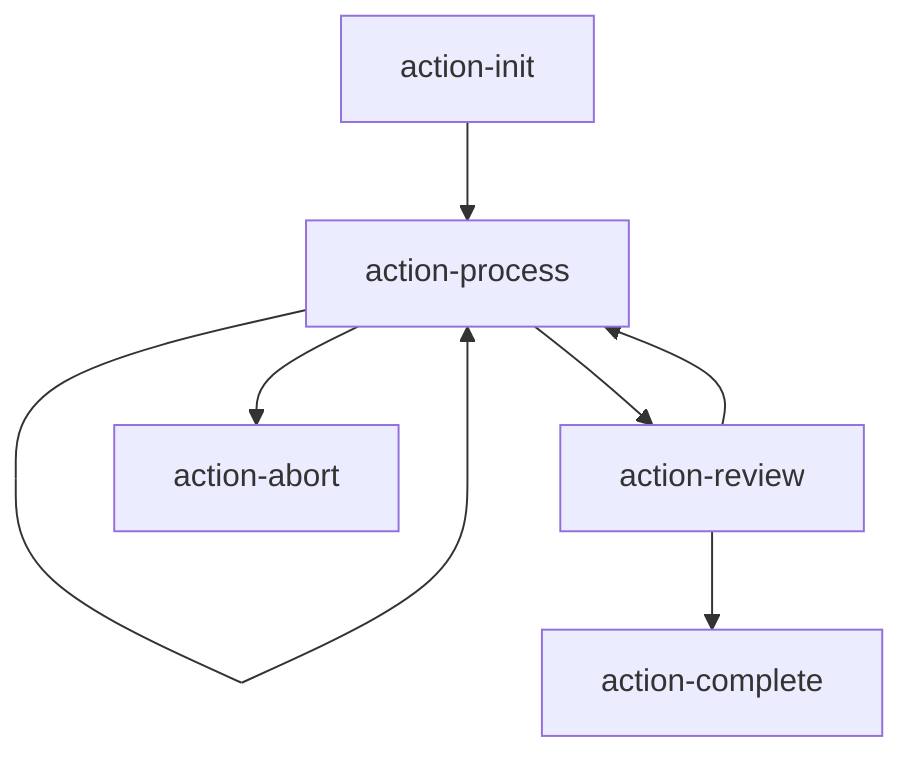

# Execution Modes Specification

Detailed specification definitions for two Skill execution modes.

---

## Mode Overview

| Feature | Sequential (Fixed Order) | Autonomous (Dynamic) |
|---------|--------------------------|----------------------|
| Execution Order | Fixed (numeric prefix) | Dynamic (orchestrator decision) |
| Phase Dependencies | Strong dependencies | Weak/no dependencies |
| State Management | Implicit (phase output) | Explicit (state file) |
| Use Cases | Pipeline tasks | Interactive tasks |
| Complexity | Low | Medium-High |
| Extensibility | Insert sub-phases | Add new actions |

---

## Mode 1: Sequential (Fixed Order Mode)

### Definition

Phases execute linearly in fixed order, with each phase's output serving as input to the next phase.

### Directory Structure

```
phases/
├── 01-{first-step}.md
├── 02-{second-step}.md
├── 02.5-{sub-step}.md      # Optional: sub-phase
├── 03-{third-step}.md
└── ...
```

### Execution Flow

```
┌─────────┐     ┌─────────┐     ┌─────────┐
│Phase 01 │────▶│Phase 02 │────▶│Phase 03 │────▶ ...
└─────────┘     └─────────┘     └─────────┘
     │               │               │
     ▼               ▼               ▼
  output1.json   output2.md      output3.md
```

### Phase File Specification

```markdown
# Phase N: {Phase Name}

{One-sentence description}

## Objective

{Detailed objective}

## Input

- Dependencies: {Previous phase output}
- Configuration: {Configuration file}

## Execution Steps

### Step 1: {Step}
{Execution code or description}

### Step 2: {Step}
{Execution code or description}

## Output

- **File**: `{Output file}`
- **Format**: {JSON/Markdown}

## Next Phase

→ [Phase N+1: xxx](0N+1-xxx.md)
```

### Applicable Scenarios

- **Document Generation**: Collect → Analyze → Assemble → Optimize
- **Code Analysis**: Scan → Parse → Report
- **Data Processing**: Extract → Transform → Load

### Advantages

- Clear logic, easy to understand
- Simple debugging, can validate phase by phase
- Predictable output

### Disadvantages

- Low flexibility
- Difficult to handle branching logic
- Limited user interaction

---

## Mode 2: Autonomous (Dynamic Mode)

### Definition

No fixed execution order. The orchestrator dynamically selects the next action based on current state.

### Directory Structure

```
phases/
├── orchestrator.md          # Orchestrator: core decision logic
├── state-schema.md          # State structure definition
└── actions/                 # Independent actions (no order)
    ├── action-{a}.md
    ├── action-{b}.md
    ├── action-{c}.md
    └── ...
```

### Core Components

#### 1. Orchestrator

```markdown
# Orchestrator

## Role

Select and execute the next action based on current state.

## State Reading

Read state file: `{workDir}/state.json`

## Decision Logic

```javascript
function selectNextAction(state) {
  // 1. Check termination conditions
  if (state.status === 'completed') return null;
  if (state.error_count > MAX_RETRIES) return 'action-abort';

  // 2. Select action based on state
  if (!state.initialized) return 'action-init';
  if (state.pending_items.length > 0) return 'action-process';
  if (state.needs_review) return 'action-review';

  // 3. Default action
  return 'action-complete';
}
```

## Execution Loop

```
while (true) {
  state = readState();
  action = selectNextAction(state);
  if (!action) break;

  result = executeAction(action, state);
  updateState(result);
}
```
```

#### 2. State Schema

```markdown
# State Schema

## State File

Location: `{workDir}/state.json`

## Structure Definition

```typescript
interface SkillState {
  // Metadata
  skill_name: string;
  started_at: string;
  updated_at: string;

  // Execution state
  status: 'pending' | 'running' | 'completed' | 'failed';
  current_action: string | null;
  completed_actions: string[];

  // Business data
  context: Record<string, any>;
  pending_items: any[];
  results: Record<string, any>;

  // Error tracking
  errors: Array<{
    action: string;
    message: string;
    timestamp: string;
  }>;
  error_count: number;
}
```

## Initial State

```json
{
  "skill_name": "{skill-name}",
  "started_at": "{ISO8601}",
  "updated_at": "{ISO8601}",
  "status": "pending",
  "current_action": null,
  "completed_actions": [],
  "context": {},
  "pending_items": [],
  "results": {},
  "errors": [],
  "error_count": 0
}
```
```

#### 3. Action

```markdown
# Action: {action-name}

## Purpose

{Action purpose}

## Preconditions

- [ ] Condition 1
- [ ] Condition 2

## Execution

{Execution logic}

## State Updates

```javascript
return {
  completed_actions: [...state.completed_actions, 'action-name'],
  results: {
    ...state.results,
    action_name: { /* result */ }
  },
  // Other state updates
};
```

## Next Actions (Hints)

- On success: `action-{next}`
- On failure: `action-retry` or `action-abort`
```

### Execution Flow

```
┌─────────────────────────────────────────────────────────────────┐
│                      Orchestrator Loop                           │
│  ┌─────────────────────────────────────────────────────────┐    │
│  │                                                          │    │
│  │   ┌──────────┐     ┌──────────┐     ┌──────────┐        │    │
│  │   │ Read     │────▶│ Select   │────▶│ Execute  │        │    │
│  │   │ State    │     │ Action   │     │ Action   │        │    │
│  │   └──────────┘     └──────────┘     └──────────┘        │    │
│  │        ▲                                  │              │    │
│  │        │                                  ▼              │    │
│  │        │           ┌──────────┐                         │    │
│  │        └───────────│ Update   │◀────────────────────────┘    │
│  │                    │ State    │                              │
│  │                    └──────────┘                              │
│  │                                                          │    │
│  └─────────────────────────────────────────────────────────┘    │
│                              │                                   │
│                              ▼                                   │
│                    ┌──────────────────┐                         │
│                    │ Termination?     │                         │
│                    │ - completed      │                         │
│                    │ - max_retries    │                         │
│                    │ - user_abort     │                         │
│                    └──────────────────┘                         │
└─────────────────────────────────────────────────────────────────┘
```

### Action Catalog

Defined in `specs/action-catalog.md`:

```markdown
# Action Catalog

## Available Actions

| Action | Purpose | Preconditions | Effects |
|--------|---------|---------------|---------|
| action-init | Initialize state | status=pending | status=running |
| action-process | Process pending items | pending_items.length>0 | pending_items-- |
| action-review | User review | needs_review=true | needs_review=false |
| action-complete | Complete task | pending_items.length=0 | status=completed |
| action-abort | Abort task | error_count>MAX | status=failed |

## Action Dependencies Graph


```

### Applicable Scenarios

- **Interactive Tasks**: Q&A, dialog, form filling
- **State Machine Tasks**: Issue management, workflow approval
- **Exploratory Tasks**: Debugging, diagnosis, search

### Advantages

- Highly flexible, adapts to dynamic requirements
- Supports complex branching logic
- Easy to extend with new actions

### Disadvantages

- High complexity
- State management overhead
- Large debugging difficulty

---

## Mode Selection Guide

### Decision Flow

```
Analyze user requirements
     │
     ▼
┌────────────────────────────┐
│ Are there strong           │
│ dependencies between       │
│ phases?                    │
└────────────────────────────┘
     │
     ├── Yes → Sequential
     │
     └── No → Continue decision
              │
              ▼
     ┌────────────────────────────┐
     │ Do you need dynamic         │
     │ response to user intent?    │
     └────────────────────────────┘
              │
              ├── Yes → Autonomous
              │
              └── No → Sequential
```

### Quick Decision Table

| Question | Sequential | Autonomous |
|----------|------------|------------|
| Is output structure fixed? | Yes | No |
| Do you need multi-turn user interaction? | No | Yes |
| Can phases be skipped/repeated? | No | Yes |
| Is there complex branching logic? | No | Yes |
| Should debugging be simple? | Yes | No |

---

## Hybrid Mode

Some complex Skills may need to use both modes in combination:

```
phases/
├── 01-init.md                 # Sequential: initialization
├── 02-orchestrator.md         # Autonomous: core interaction loop
│   └── actions/
│       ├── action-a.md
│       └── action-b.md
└── 03-finalize.md             # Sequential: finalization
```

**Applicable Scenarios**:
- Initialization and finalization are fixed, middle interaction is flexible
- Multi-phase tasks where certain phases need dynamic decisions
