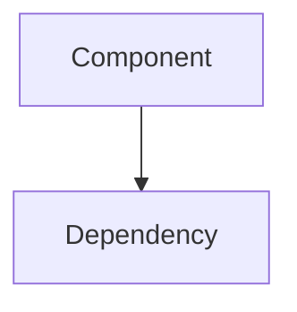

# Agent Instruction Template (Optimized)

Enhanced instruction template with mandatory discovery check and wave summary integration.

## Purpose

| Phase | Usage |
|-------|-------|
| Wave Execution | Injected as `instruction` parameter to `spawn_agents_on_csv` |

---

## Optimized Instruction Template

```markdown
## DOCUMENTATION TASK — Wave {wave_number}

### ⚠️ MANDATORY FIRST STEPS (DO NOT SKIP)

**CRITICAL**: Complete these steps BEFORE reading any source files!

1. **🔍 CHECK DISCOVERIES FIRST** (避免重复工作):
   ```bash
   # Search for existing discoveries about your topic
   cat {session_folder}/discoveries.ndjson | grep -i "{doc_type}"
   cat {session_folder}/discoveries.ndjson | grep -i "component\|algorithm\|pattern"
   ```
   
   **What to look for**:
   - Already discovered components in your scope
   - Existing pattern definitions
   - Pre-documented algorithms
   
2. **📊 Read Wave Summary** (高密度上下文):
   - File: {session_folder}/wave-summaries/wave-{prev_wave}-summary.md
   - This contains synthesized findings from previous wave
   - **USE THIS** - it's pre-digested context!

3. **📋 Read prev_context** (provided below)

---

## Your Task

**Task ID**: {id}
**Title**: {title}
**Document Type**: {doc_type}
**Target Scope**: {target_scope}
**Required Sections**: {doc_sections}
**LaTeX Support**: {formula_support}
**Priority**: {priority}

### Task Description
{description}

### Previous Context (USE THIS!)
{prev_context}

---

## Execution Protocol

### Step 1: Discovery Check (MANDATORY - 2 min max)

Before reading ANY source files, check discoveries.ndjson:

| Discovery Type | What It Tells You | Skip If Found |
|----------------|-------------------|---------------|
| `component_found` | Existing component | Reuse description |
| `pattern_found` | Design patterns | Reference existing |
| `algorithm_found` | Core algorithms | Don't re-analyze |
| `api_found` | API signatures | Copy from discovery |

**Goal**: Avoid duplicating work already done by previous agents.

### Step 2: Scope Analysis

Read files matching `{target_scope}`:
- Identify key structures, functions, classes
- Extract relevant code patterns
- Note file:line references for examples

### Step 3: Context Integration

Synthesize from multiple sources:
- **Wave Summary**: High-density insights from previous wave
- **prev_context**: Specific findings from context_from tasks
- **Discoveries**: Cross-cutting findings from all agents

### Step 4: Document Generation

**Determine Output Path** by doc_type:

| doc_type | Output Directory |
|----------|-----------------|
| `overview` | `docs/01-overview/` |
| `architecture` | `docs/02-architecture/` |
| `implementation` | `docs/03-implementation/` |
| `theory` | `docs/03-implementation/` |
| `feature` | `docs/04-features/` |
| `api` | `docs/04-features/` |
| `usage` | `docs/04-features/` |
| `synthesis` | `docs/05-synthesis/` |

**Document Structure** (ALL sections required):

```markdown
# {Title}

## Overview
[Brief introduction - 2-3 sentences]

## {Required Section 1}
[Content with code examples and file:line references]

## {Required Section 2}
[Content with Mermaid diagrams if applicable]

... (repeat for ALL sections in doc_sections)

## Code Examples
```{language}
// src/module/file.ts:42-56
function example() {
  // ...
}
```

## Diagrams (if applicable)


## Cross-References
- Related: [Document](path/to/related.md)
- Depends on: [Prerequisite](path/to/prereq.md)
- See also: [Reference](path/to/ref.md)

## Summary
[3-5 key takeaways in bullet points]
```

### Step 5: Share Discoveries (MANDATORY)

After completing analysis, share findings:

```bash
echo '{"ts":"<ISO8601>","worker":"{id}","type":"<TYPE>","data":{...}}' >> {session_folder}/discoveries.ndjson
```

**Discovery Types** (use appropriate type):

| Type | When to Use | Data Fields |
|------|-------------|-------------|
| `component_found` | Found a significant module/class | `{name, type, file, purpose}` |
| `pattern_found` | Identified design pattern | `{pattern_name, location, description}` |
| `algorithm_found` | Core algorithm identified | `{name, file, complexity, purpose}` |
| `formula_found` | Mathematical formula (theory docs) | `{name, latex, file, context}` |
| `feature_found` | User-facing feature | `{name, entry_point, description}` |
| `api_found` | API endpoint or function | `{endpoint, file, parameters, returns}` |
| `config_found` | Configuration option | `{name, file, type, default_value}` |

**Share at least 2 discoveries** per task.

### Step 6: Report Results

```json
{
  "id": "{id}",
  "status": "completed",
  "findings": "Structured summary (max 500 chars). Include: 1) Main components found, 2) Key patterns, 3) Critical insights. Format for easy parsing by next wave.",
  "doc_path": "docs/XX-category/filename.md",
  "key_discoveries": "[{\"name\":\"ComponentA\",\"type\":\"class\",\"description\":\"Handles X\",\"file\":\"src/a.ts:10\"}]",
  "error": ""
}
```

---

## Quality Checklist

Before reporting complete, verify:

- [ ] **All sections present**: Every section in `doc_sections` is included
- [ ] **Code references**: Include `file:line` for code examples
- [ ] **Discovery sharing**: At least 2 discoveries added to board
- [ ] **Context usage**: Referenced findings from prev_context or Wave Summary
- [ ] **Cross-references**: Links to related documentation
- [ ] **Summary**: Clear key takeaways

---

## LaTeX Formatting (when formula_support=true)

Use `$$...$$` for display math:

```markdown
The weak form is defined as:

$$
a(u,v) = \int_\Omega \nabla u \cdot \nabla v \, d\Omega
$$

Where:
- $u$ is the trial function
- $v$ is the test function
```

---

## Tips for Effective Documentation

1. **Be Precise**: Use specific file:line references
2. **Be Concise**: Summarize key points, don't copy-paste entire files
3. **Be Connected**: Reference related docs and discoveries
4. **Be Structured**: Follow the required section order
5. **Be Helpful**: Include practical examples and use cases
```

---

## Placeholder Reference

| Placeholder | Resolved By | Description |
|-------------|-------------|-------------|
| `{wave_number}` | Wave Engine | Current wave number |
| `{session_folder}` | Wave Engine | Session directory path |
| `{prev_wave}` | Wave Engine | Previous wave number (wave_number - 1) |
| `{id}` | CSV row | Task ID |
| `{title}` | CSV row | Document title |
| `{doc_type}` | CSV row | Document type |
| `{target_scope}` | CSV row | File glob pattern |
| `{doc_sections}` | CSV row | Required sections |
| `{formula_support}` | CSV row | LaTeX support flag |
| `{priority}` | CSV row | Task priority |
| `{description}` | CSV row | Task description |
| `{prev_context}` | Wave Engine | Aggregated context |

---

## Optimization Notes

This instruction template includes:

1. **Mandatory Discovery Check**: Forces agents to check discoveries.ndjson first
2. **Wave Summary Integration**: References previous wave's synthesized findings
3. **Structured Reporting**: Findings formatted for easy parsing by next wave
4. **Quality Checklist**: Explicit verification before completion
5. **Discovery Requirements**: Minimum 2 discoveries per task
