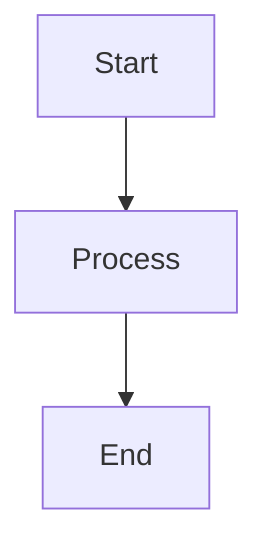

# Quality Standards for Documentation

Quality assessment criteria for generated documentation.

---

## Quality Dimensions

### 1. Completeness (30%)

| Score | Criteria |
|-------|----------|
| 100% | All required sections present, all topics covered |
| 80% | All sections present, some topics incomplete |
| 60% | Most sections present, some missing |
| 40% | Several sections missing |
| 0% | Major sections absent |

**Checklist per Document**:
- [ ] All sections in `doc_sections` are present
- [ ] Each section has substantial content (not just placeholders)
- [ ] Cross-references to related documentation
- [ ] Code examples where applicable
- [ ] Diagrams where applicable

### 2. Accuracy (25%)

| Score | Criteria |
|-------|----------|
| 100% | All information correct, file references accurate |
| 80% | Minor inaccuracies, most references correct |
| 60% | Some errors, most file references work |
| 40% | Multiple errors, broken references |
| 0% | Significant inaccuracies |

**Checklist**:
- [ ] Code examples compile/run correctly
- [ ] File paths and line numbers are accurate
- [ ] API signatures match actual implementation
- [ ] Configuration examples are valid
- [ ] Dependencies and versions are correct

### 3. Clarity (25%)

| Score | Criteria |
|-------|----------|
| 100% | Clear, concise, well-organized, easy to navigate |
| 80% | Clear, minor organization issues |
| 60% | Understandable but could be clearer |
| 40% | Confusing in places |
| 0% | Unclear, hard to follow |

**Checklist**:
- [ ] Logical flow and organization
- [ ] Clear headings and subheadings
- [ ] Appropriate level of detail
- [ ] Well-formatted code blocks
- [ ] Readable diagrams

### 4. Context Integration (20%)

| Score | Criteria |
|-------|----------|
| 100% | Builds on previous waves, references earlier findings |
| 80% | Good context usage, minor gaps |
| 60% | Some context usage, could be more |
| 40% | Limited context usage |
| 0% | No context from previous waves |

**Checklist**:
- [ ] References findings from context_from tasks
- [ ] Uses discoveries.ndjson
- [ ] Cross-references related documentation
- [ ] Builds on previous wave outputs
- [ ] Maintains consistency across documents

---

## Quality Gates (Per-Wave)

| Wave | Gate Criteria | Required Completion |
|------|--------------|---------------------|
| 1 | Overview + Tech Stack + Directory | 3/3 completed |
| 2 | Architecture docs with diagrams | ≥3/4 completed |
| 3 | Implementation details with code | ≥3/4 completed |
| 4 | Feature + Usage + API docs | ≥2/3 completed |
| 5 | Synthesis with README | 3/3 completed |

---

## Document Quality Metrics

| Metric | Target | Measurement |
|--------|--------|-------------|
| Section coverage | 100% | Required sections present |
| Code example density | ≥1 per major topic | Code blocks per section |
| File reference accuracy | ≥95% | Valid file:line references |
| Cross-reference density | ≥2 per document | Links to other docs |
| Diagram presence | Required for architecture | Diagrams in arch docs |

---

## Issue Severity Levels

### Critical (Must Fix)
- Missing required section
- Broken cross-references
- Incorrect API documentation
- Code examples that don't work
- File references to non-existent files

### High (Should Fix)
- Incomplete section content
- Minor inaccuracies
- Missing diagrams in architecture docs
- Outdated dependency versions
- Unclear explanations

### Medium (Nice to Fix)
- Formatting issues
- Suboptimal organization
- Missing optional content
- Minor typos

### Low (Optional)
- Style consistency
- Additional examples
- More detailed explanations

---

## Quality Scoring

### Per-Document Score

```
Score = (Completeness × 0.30) + (Accuracy × 0.25) + (Clarity × 0.25) + (Context × 0.20)
```

### Overall Session Score

```
Score = Σ(Document Score × Weight) / Σ(Weights)
```

**Weights by Wave**:
| Wave | Weight | Rationale |
|------|--------|-----------|
| 1 | 1.0 | Foundation |
| 2 | 1.5 | Core architecture |
| 3 | 1.5 | Implementation depth |
| 4 | 1.0 | User-facing |
| 5 | 2.0 | Synthesis quality |

### Quality Thresholds

| Score | Status | Action |
|-------|--------|--------|
| ≥85% | PASS | Ready for delivery |
| 70-84% | REVIEW | Flag for improvement |
| <70% | FAIL | Block, require re-generation |

---

## Documentation Style Guide

### Markdown Standards
- Use ATX headings (# ## ###)
- Code blocks with language hints
- Mermaid for diagrams
- Tables for structured data

### Code Reference Format
```
src/module/file.ts:42-56
```

### Cross-Reference Format
```markdown
See: [Document Title](path/to/doc.md#section)
```

### LaTeX Format (when formula_support=true)
```markdown
$$
\frac{\partial u}{\partial t} = \nabla^2 u
$$
```

### Diagram Format

