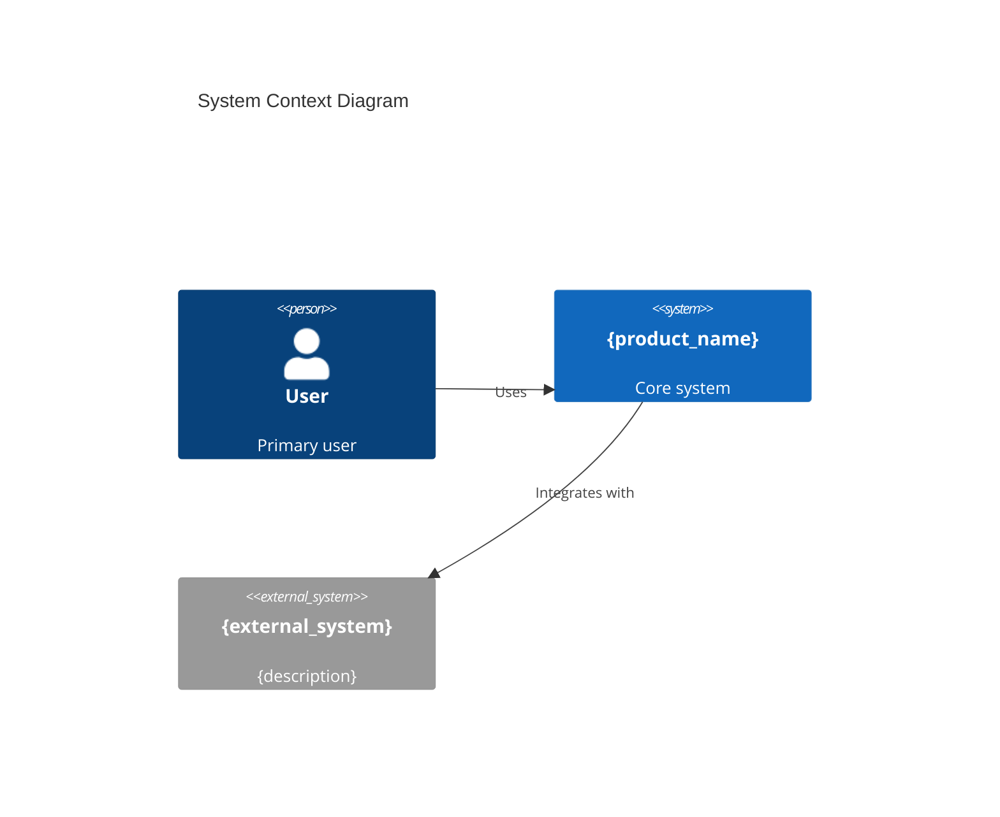
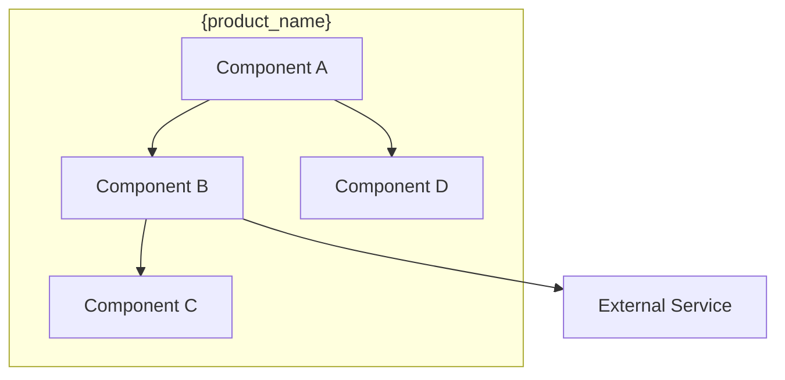
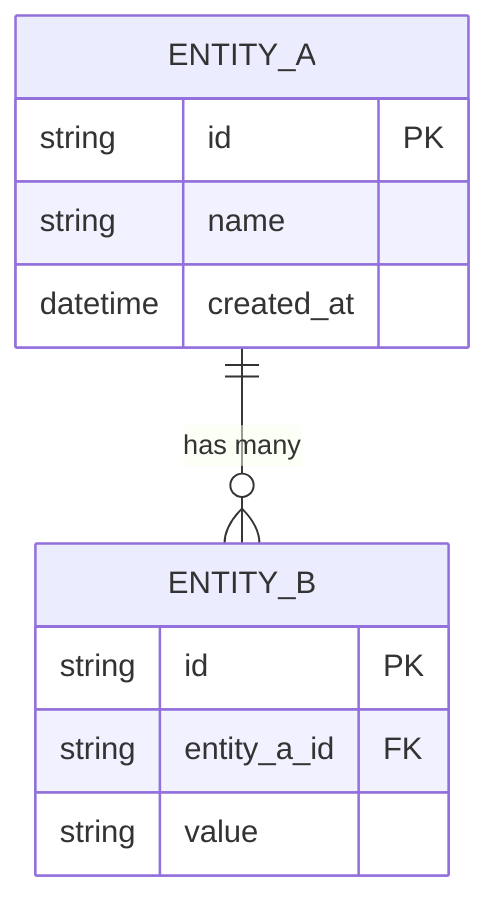

# Architecture Document Template (Directory Structure)

Template for generating architecture decision documents as a directory of individual ADR files in Phase 4.

## Usage Context

| Phase | Usage |
|-------|-------|
| Phase 4 (Architecture) | Generate `architecture/` directory from requirements analysis |
| Output Location | `{workDir}/architecture/` |

## Output Structure

```
{workDir}/architecture/
├── _index.md                      # Overview, components, tech stack, data model, security
├── ADR-001-{slug}.md              # Individual Architecture Decision Record
├── ADR-002-{slug}.md
└── ...
```

---

## Template: _index.md

```markdown
---
session_id: {session_id}
phase: 4
document_type: architecture-index
status: draft
generated_at: {timestamp}
version: 1
dependencies:
  - ../spec-config.json
  - ../product-brief.md
  - ../requirements/_index.md
---

# Architecture: {product_name}

{executive_summary - high-level architecture approach and key decisions}

## System Overview

### Architecture Style
{description of chosen architecture style: microservices, monolith, serverless, etc.}

### System Context Diagram



## Component Architecture

### Component Diagram



### Component Descriptions

| Component | Responsibility | Technology | Dependencies |
|-----------|---------------|------------|--------------|
| {component_name} | {what it does} | {tech stack} | {depends on} |

## Technology Stack

### Core Technologies

| Layer | Technology | Version | Rationale |
|-------|-----------|---------|-----------|
| Frontend | {technology} | {version} | {why chosen} |
| Backend | {technology} | {version} | {why chosen} |
| Database | {technology} | {version} | {why chosen} |
| Infrastructure | {technology} | {version} | {why chosen} |

### Key Libraries & Frameworks

| Library | Purpose | License |
|---------|---------|---------|
| {library_name} | {purpose} | {license} |

## Architecture Decision Records

| ADR | Title | Status | Key Choice |
|-----|-------|--------|------------|
| [ADR-001](ADR-001-{slug}.md) | {title} | Accepted | {one-line summary} |
| [ADR-002](ADR-002-{slug}.md) | {title} | Accepted | {one-line summary} |
| [ADR-003](ADR-003-{slug}.md) | {title} | Proposed | {one-line summary} |

## Data Architecture

### Data Model



### Data Storage Strategy

| Data Type | Storage | Retention | Backup |
|-----------|---------|-----------|--------|
| {type} | {storage solution} | {retention policy} | {backup strategy} |

## API Design

### API Overview

| Endpoint | Method | Purpose | Auth |
|----------|--------|---------|------|
| {/api/resource} | {GET/POST/etc} | {purpose} | {auth type} |

## Security Architecture

### Security Controls

| Control | Implementation | Requirement |
|---------|---------------|-------------|
| Authentication | {approach} | [NFR-S-{NNN}](../requirements/NFR-S-{NNN}-{slug}.md) |
| Authorization | {approach} | [NFR-S-{NNN}](../requirements/NFR-S-{NNN}-{slug}.md) |
| Data Protection | {approach} | [NFR-S-{NNN}](../requirements/NFR-S-{NNN}-{slug}.md) |

## Infrastructure & Deployment

### Deployment Architecture

{description of deployment model: containers, serverless, VMs, etc.}

### Environment Strategy

| Environment | Purpose | Configuration |
|-------------|---------|---------------|
| Development | Local development | {config} |
| Staging | Pre-production testing | {config} |
| Production | Live system | {config} |

## Codebase Integration

{if has_codebase is true:}

### Existing Code Mapping

| New Component | Existing Module | Integration Type | Notes |
|--------------|----------------|------------------|-------|
| {component} | {existing module path} | Extend/Replace/New | {notes} |

### Migration Notes
{any migration considerations for existing code}

## Quality Attributes

| Attribute | Target | Measurement | ADR Reference |
|-----------|--------|-------------|---------------|
| Performance | {target} | {how measured} | [ADR-{NNN}](ADR-{NNN}-{slug}.md) |
| Scalability | {target} | {how measured} | [ADR-{NNN}](ADR-{NNN}-{slug}.md) |
| Reliability | {target} | {how measured} | [ADR-{NNN}](ADR-{NNN}-{slug}.md) |

## Risks & Mitigations

| Risk | Impact | Probability | Mitigation |
|------|--------|-------------|------------|
| {risk} | High/Medium/Low | High/Medium/Low | {mitigation approach} |

## Open Questions

- [ ] {architectural question 1}
- [ ] {architectural question 2}

## References

- Derived from: [Requirements](../requirements/_index.md), [Product Brief](../product-brief.md)
- Next: [Epics & Stories](../epics/_index.md)
```

---

## Template: ADR-NNN-{slug}.md (Individual Architecture Decision Record)

```markdown
---
id: ADR-{NNN}
status: Accepted
traces_to: [{REQ-NNN}, {NFR-X-NNN}]
date: {timestamp}
---

# ADR-{NNN}: {decision_title}

## Context

{what is the situation that motivates this decision}

## Decision

{what is the chosen approach}

## Alternatives Considered

| Option | Pros | Cons |
|--------|------|------|
| {option_1 - chosen} | {pros} | {cons} |
| {option_2} | {pros} | {cons} |
| {option_3} | {pros} | {cons} |

## Consequences

- **Positive**: {positive outcomes}
- **Negative**: {tradeoffs accepted}
- **Risks**: {risks to monitor}

## Traces

- **Requirements**: [REQ-{NNN}](../requirements/REQ-{NNN}-{slug}.md), [NFR-X-{NNN}](../requirements/NFR-X-{NNN}-{slug}.md)
- **Implemented by**: [EPIC-{NNN}](../epics/EPIC-{NNN}-{slug}.md) (added in Phase 5)
```

---

## Variable Descriptions

| Variable | Source | Description |
|----------|--------|-------------|
| `{session_id}` | spec-config.json | Session identifier |
| `{timestamp}` | Runtime | ISO8601 generation timestamp |
| `{product_name}` | product-brief.md | Product/feature name |
| `{NNN}` | Auto-increment | ADR/requirement number |
| `{slug}` | Auto-generated | Kebab-case from decision title |
| `{has_codebase}` | spec-config.json | Whether existing codebase exists |
